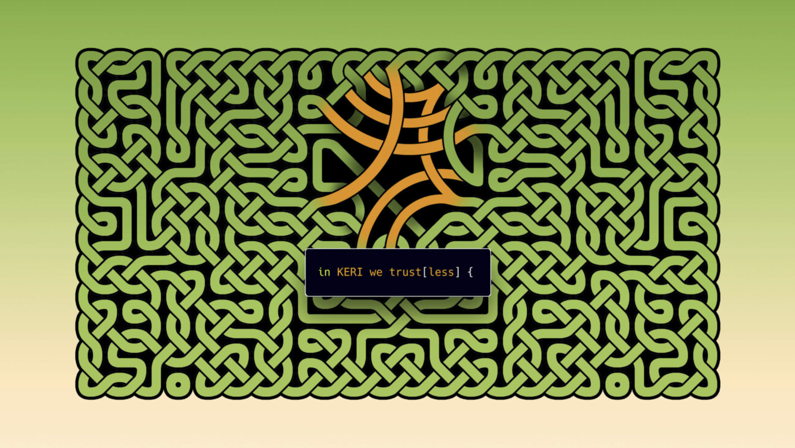

# KERI
Key Event Receipt Infrastructure - the spec and implementation of the KERI protocol

## Starting Points
* For an overview and introduction, see the explanatory **slideshow** [here](https://github.com/SmithSamuelM/Papers/blob/master/presentations/KERI2_Overview.web.pdf) or the public-facing <a href=https://keri.one>website</a>.
* The most recent version of the **whitepaper** is [here](https://github.com/decentralized-identity/keri/blob/master/kids/KERI_WP.pdf). It contains an overview of the functional requirements and design of the KERI protocol, but should not be taken as authoritative as a specification and predates the experimental implementation.
* Definitions, **Questions and Answers** categorized by topic [here](./docs/Q-and-A.md).
* **Contributor guidelines** can be found [here](contributing.md).
* As the first **experimental prototype** is developed in [python](https://github.com/decentralized-identity/keripy), updates to the white paper's concepts and new implementation guidance alike are being moved into "KERI implementation documents" (KIDs), which are the building blocks of the spec being refined in dialogue with the first implementations done through the group. ALL of this work (implementation and specs alike) are in PROPOSED stage at best, and in some cases even in EXPERIMENTAL mode (some code commits not even discussed).
* There are separate **repositories** for [Python](https://github.com/decentralized-identity/keripy/), [Rust](https://github.com/decentralized-identity/keriox/), [JavaScript](https://github.com/decentralized-identity/kerijs/), and the newest addition, [Go](https://github.com/decentralized-identity/kerigo/).

## Ways to contribute
* We are gathering inputs and working on a skeleton for a spec in the hours BEFORE our **weekly developer sync meetings**
* Feel free to **[open an issue](https://github.com/decentralized-identity/keri/issues)** here if you have use-case ideas!

## Acknowledgements
[KERI image](./images/KERI_image_by_CChunningham.png) by Charles Chunningham, license unknown
