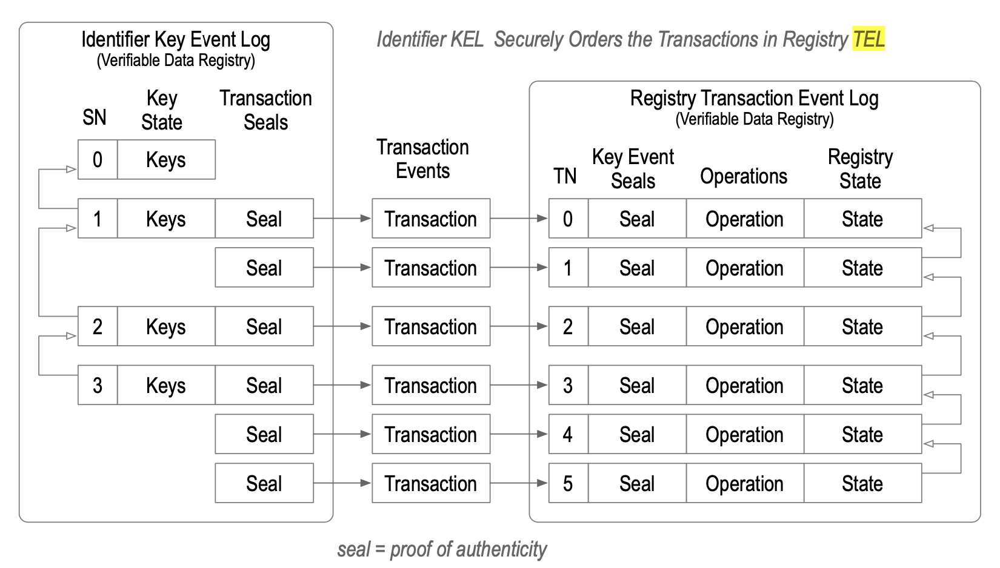
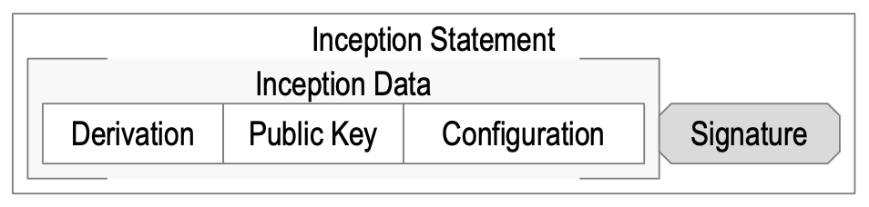
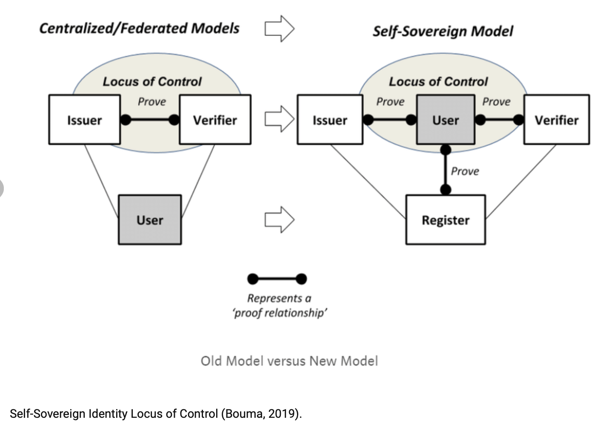
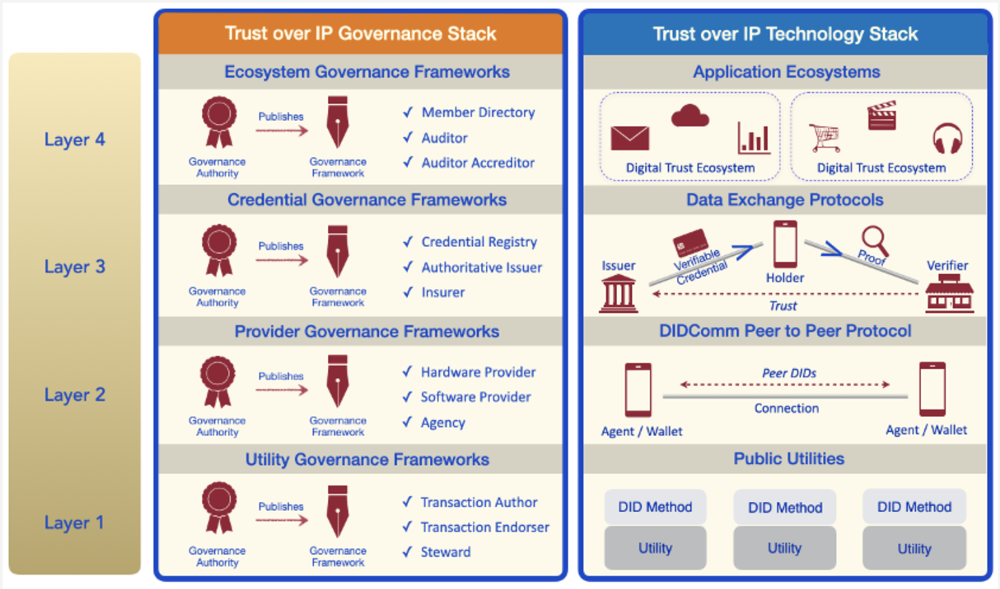
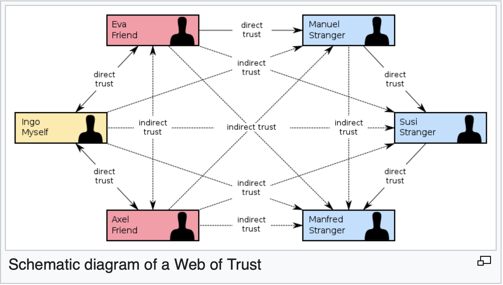

```
"What if PBFT and Stellar had a baby?
that was missing liveness and total ordering 
but had safety and was completely decentralized, portable, and permission-less? 
It would be named KERI."
SamMSmith
```

# Definitions
This Glossary makes the distinction between definitions well known in the Self Sovereign Identity space and those that are totally new and KERI specific.

```
KERI protocol solves one problem. **Secure Attribution**. 
It by itself does not solve all the other layered on top problems that verifiable credential's need to be solved. 
But one can't solve any of the verifiable credentials problems at least with any degree of security if one does not first solve the secure attribution problem. 
Given one has solved secure attribution one can layer on other things like transaction event logs to solve other problems. 
```

### KERI specific abbreviations
In alphabetic order:\
DEL = [Duplicitous Event Log](#duplicitous-event-log)\
KAACE = [KERI Agreement Algorithm for Control Establishment](#keri-agreement-algorithm-for-control-establishment)
KEL = [Key Event Log](#key-event-log)\
KERL = [Key Event Receipt Log](#key-event-receipt-log)\
KERI = [Key Event Receipt Infrastructure](#key-event-receipt-infrastructure)\
KID = [KERI Implementation/Improvement Docs](#keri-implementation-Improvement-docs)\
TEL = [Transaction Event Log](#transaction-event-log)

### KERI specific definitions in alphabetic order:

#### Ambient Verifiability 
_Ambient_ means all around, abundantly available. It is a new term to better describe [end-verifiable](#end-verifiable) end state. The _combination_ of end verifiable logs served by ambient infrastructure _enables_ ambient verifiability, that is, **anyone can verify anywhere at anytime**. This approach exhibits some of the features of [certificate transparency](#certificate-transparency) and [key transparency](#key-transparency) with end-verifiable event logs but differs in that each identifier has its own chain of events that are rooted in a [self-certifying identifier](#self-certifying-identifier).

#### Composable derivation codes on cryptographic material primitives 
KERI's design both requires - and benefits from - a universal compact encoding for all cryptographic material items with stable self-framing textual derivation codes.\
(new invention) More info in [KID0001](https://github.com/decentralized-identity/keri/blob/master/kids/kid0001Comment.md)


#### Composable text and binary representation streaming protocol 
This compact encoding scheme fully supports both textual and binary streaming applications of attached crypto material of all types. This approach includes composability in both the textual and binary streaming domains. The primitives may be the minimum possible but still composable size. Making composablity a guaranteed property allows future extensible support of new compositions of streaming formats based on pre-existing core primitives and compositions of core primitives. This enables optimized stream processing in both the binary and text domains. \
(new invention) More info in [KID0001](https://github.com/decentralized-identity/keri/blob/master/kids/kid0001Comment.md)

#### Duplicitous event log
Or DEL. This is a record of _inconsistent_ event messages produced by a given controller or witness with respect to a given `KERL`. The duplicitous events are indexed to the corresponding event in a KERL. A duplicitous event is represented by a set of two or more provably mutually inconsistent event messages with respect to a KERL. Each `juror` keeps a duplicitous event log (DEL) for each controller and all designated witness with respect to a KERL. Any validator may confirm duplicity by examining a DEL.

#### Generic classes self-certifying identifiers 

The KERI design approach is to build composable primitives instead of custom functionality that is so typical of other DKMI approaches:
- transferable identifiers
- non-transferable identifiers
- delegated identifiers
Consequently when applied recursively, _delegation_ may be used to compose arbitrarily complex trees of hierarchical (delegative) key management event streams. This is a most powerful capability that may provide an essential building block for a generic universal decentralized key management infrastructure (DKMI) that is also compatible with the demands of generic event streaming applications.\
(new invention) More in the [whitepaper](https://github.com/SmithSamuelM/Papers/blob/master/whitepapers/KERI_WP_2.x.web.pdf)

{TBW prio 1}

#### KERI Agreement Algorithm for Control Establishment
Also KAACE or KA2CE. A newly invented algorithm but it is a simplification of PBFT class algorithms, separation of control of distributed consensus using distinct promulgation (`witness`) and confirmation (`watcher`) networks (new invention) but many non-BFT consensus algorithms do something similar and one BFT algorithm Stellar does something similar but not the same.\
What if PBFT and Stellar had a baby that was missing liveness and total ordering but had safety and was completely decentralized, portable, and permission less? It would be named KERI.\
(_SamMSmith_)

#### Key compromise

Basically there are three infrastructures that are included in “key management” systems that must be protected.
1.  Key pair creation and storage
2. Event signing
3. Event signature verification.

So when we say “key compromise” we really mean compromise of **one of those three things**.  

More in the security sections of [Universal Identifier Theory](https://github.com/SmithSamuelM/Papers/blob/master/whitepapers/IdentifierTheory_web.pdf)

#### Key Event Log
Also `KEL`. Hash-chained Key Events, these are blockchains in a narrow definition, but not in the sense of ordering (not ordered) or global consensus mechanisms (not needed).
_(SamMSmith)_ \
A KEL is KERI's `VDS`: the proof of key state of its identifier.

#### Key Event Receipt Infrastructure
Also `KERI`.  KERI is a new approach to decentralized identifiers and decentralized key management that promises significant benefits for `SSI` (self-sovereign identity) and `ToIP` (Trust over IP) infrastructure.\
(_@drummondreed_)

KERI is an identifier system that fixes the internet. It's a fully decentralized permission-less key management architecture. It solves the `secure attribution problem` to its identifiers and allows portability.\
(_@henkvancann_)

While attribution has always been a non-exact science, we could come as close to attribution as “beyond a reasonable doubt”, those days are over with KERI.\
KERI provides a trust spanning layer for the internet, because **the protocol solves the secure attribution problem** in a general, portable, fully decentralized way. There are more types of trust IN KERI but they all depend on the most important _attributional_ trust.\
From KERI we've learned that _secure attribution_ is the essential problem for _any_ `identifier system` to solve.\
(_@henkvancann_)

KERI is also a Keltic woman's name.

#### Key Event Receipt Log
Also `KERL`. Signed Key Events, keeping track of establishment events. To begin with the inception event and any number of rotation events. We call that the _establishment subsequence_. \
(_@henkvancann_)


_(SamMSmith)_

#### Keridemlia
It is a contraction of KERI and [Kademlia](https://en.wikipedia.org/wiki/Kademlia). It's the distributed database of Witness IP-addresses based on a Distributed Hash Tabel. It also does the CNAME - stuff that DNS offers for KERI: the mapping between an identifier and it's controller AID stored in the KEL to its current wittness AID and the wittness AID to the IP address.\
(_@henkvancann_)

#### KERI Implementation/Improvement Docs
Or KIDs. These docs are modular so teams of contributors can independently work and create PRs of individual KIDs; KIDs answer the question "how we do it". We add commentary to the indivudual KIDs that elaborate on the _why_. It has been split from the _how_ to not bother implementors with the _why_.

#### Nested cooperative delegated identifiers 
In KERI delegations are cooperative, this means that both the delegator and delegate must contribute to a delegation. The delegator creates a cryptographic commitment in either a rotation or interaction event via a seal a a delegated establishment event. The delegate creates a cryptographic commitment in its establishment event via a seal to the delegating event. Each commitment is signed respectively by the committer ... This cooperative delegation together with special superseding recovery rules for events enables cooperative recovery.

This superseding rule may be recursively applied to multiple levels of delegation, thereby enabling recovery of any set of keys signing or pre-rotated in any lower levels by a superseding rotation delegation at the next higher level. This cascades the security of the key management infrastructure of higher levels to lower levels. This is a _distinctive_ security feature of the cooperative delegation of identifiers in KERI.

(new invention) More in chapter _Nested Delegation Recovery_ of the [whitepaper](https://github.com/SmithSamuelM/Papers/blob/master/whitepapers/KERI_WP_2.x.web.pdf)\
{TBW prio 1}

#### Pre-rotation 
It is a new invention in KERI. Pre-rotation is a _cryptographical commitment (a hash)_ to the _next_ private key in the rotation-scheme.\
The pre-rotation scheme provides secure verifiable rotation that mitigates successful exploit of a given set of signing private keys from a set of (public, private) key-pairs when that exploit happens sometime **after** its creation _and_ its first use to issue a `self-certifying identifier`. In other words, it assumes that the private keys remains private **until after** issuance of the associated identifier.\
[Source: chapter Pre-rotation in whitepaper](https://github.com/SmithSamuelM/Papers/blob/master/whitepapers/KERI_WP_2.x.web.pdf)

#### Transaction Event Log
Also `TEL`: An externally anchored transactions via cryptographic commitments in a `KEL`.\
The set of transactions that determine registry state form a log called a Transaction Event Log (TEL). The TEL provides a cryptographic proof of registry state by reference to the corresponding controlling KEL.
Any validator may therefore cryptographically verify the authoritative state of the registry.


```
So KERI introduces for the first time many entirely new innovative concepts that are derived from many well known concepts. 
Each new invention is by itself worthy of its own white paper.
This results in new terminology. Some are entirely new words used in entirely new ways. Others are adaptations of existing
terms but defined more precisiely for the KERI innovative use.
```
We move forward with **Not KERI specific Terminology**.

### Abbreviations
In alphabetic order:\
ACDC = Authentic Chained Data Container Task Force\
AID = [Autonomic Identifier](#autonomic-identifier)\
AIS = [Autonomic Identity System](#autonomic-identity-system)\
AN = [Autonomic Namespace](#autonomic-namespace)\
BA = [Byzantine Agreement](#byzantine-agreement)\
BFT = [Byzantine Fault Tolerance](#byzantine-fault-tolerance)\
CT = [Certificate Transparency](#certificate-transparency)\
DID = [Decentralized Identity](#decentralized-identity) or Digital Identity dependent of the context.\
DIF = Decentralized Identity Foundation\
DDO = DID Document, look up W3D DID standardization for more info\
DHT = Distributed Hash Table\
DIF = Decentralized Identity Foundation, https://identity.foundation.   \
DKMI = Decentralized Key Mangement Infrastructure\
GPG = [GNU Privacy Guard](#pgp-and-gpg)\
HSM = Hardware Security Module\
IPv4 = standard Internet Protocol, version 4\
LOA = [Levels Of Assurance](#levels-of-assurance)\
PBFT = [practical Byzantine Fault Tolerance](#byzantine-fault-tolerance)\
PGP = [Pretty Good Privacy](#pgp-and-gpg)\
PKI = [Public Key Infrastructure](#public-key-infrastructure)\
PoA = Proof of Authority\
PoW = Proof of Work\
PR = Pull Request; github terminology\
SAI = [Self Addressing Identifier](#self-addressing-identifier)\
SASCI = [Self Addressing self certifying Identifier](#self-addressing-identifier)\
SCI = [Self Certifying Identifier](#self-certifying-identifier)\
SOT = [Source-of-truth](#source-of-truth)\
SSI = [Self Sovereign Identity](#self-sovereign-identity)\
VC = Verifiable Credential, look up W3D DID standardization for more info\
VDS = [Verifiable Data Structure](#verifiable-data-structure)\
WASM = [WebAssembly](#WebAssembly)

### Definitions in alphabetic order:

#### Authentic Chained Data Container Task Force
The purpose of the Authentic Chained Data Container (ACDC) Task Force  is to draft a TSS (ToIP Standard Specification) that defines the standard requirements for the semantics of Authentic Provenance Chaining of Authentic Data Containers. [See more](https://wiki.trustoverip.org/display/HOME/ACDC+%28Authentic+Chained+Data+Container%29+Task+Force)

#### Ambient verifiability
Verifiable by anyone, anywhere, at anytime. E.g. Ambient Duplicity Detection describes the possibility of detecting duplicity by anyone, anywhere, anytime.

#### Agent
A representative for an _identity_. MAY require the use of a _wallet_. MAY support _transfer_

#### Agency
Agents can be people, edge computers and the functionality within [`wallets`](#digital-identity-wallet). The service an agent offers is agency.

#### Append only event logs
Append-only is a property of computer data storage such that new data can be appended to the storage, but where **existing data is immutable**.

A blockchain is an example of an append-only log. The events can be transactions. Bitcoin is a well-known Append only log where the events are [totally ordered](#total-ordering) and signed transfers of control over unspent transaction output.\
More on [Wikipedia](https://en.wikipedia.org/wiki/Append-only)

#### Autonomic Computing Systems 
Self managing computing systems using algorithmic governance, from the 90's way way way before DAOs. KERI creator Sma Smith worked at funded Navy research in the 90's on _autonomic surviveable systems_ as in  "self-healing" systems: "We called them autonomic way back then".

#### Autonomic Identifier
An identifier that is self-certifying and self-sovereign

#### Autonomic Namespace
A namespace that is self-certifying and hence self-administrating. ANs are therefore portable = truly self sovereign.\
See basic explanation of [Namespace](#namespace).

#### Autonomic idenity system
In the design of an identity system you need to answer a few questions.


There's nobody that can intervene with the establishment of the authenticity of a control operation because you can verify all the way back to the root-of-trust.

#### Binding
In short, the technique of connecting two data elements together. In the context of KERI it is the association of data or an identifier with another identifier or a subject (a person, organization or machine), thereby lifting the privacy of the subject through that connection, i.e. binding.

#### Byzantine Agreement
_(non `PoW`)_
Byzantine Agreement is Byzantine fault tolerance of distributed computing systems that enable them to come to consensus despite arbitrary behavior from a fraction of the nodes in the network. `BA` consensus makes no assumptions about the behavior of nodes in the system. Practical Byzantine Fault Tolerance (pBFT) is the prototypical model for `Byzantine agreement`, and it can reach consensus fast and efficiently while concurrently decoupling consensus from resources (i.e., financial stake in `PoS` or electricity in `PoW`).\
[More](https://blockonomi.com/stellar-consensus-protocol/)

#### Byzantine Fault Tolerance
Also `BFT`. A **Byzantine fault** (also _interactive consistency, source congruency, error avalanche, Byzantine agreement problem, Byzantine generals problem,_ and _Byzantine failure_) is a condition of a computer system, **particularly distributed computing systems**, where components may fail and there is imperfect information on whether a component has failed. The term takes its name from an allegory, the "Byzantine Generals Problem", developed to describe a situation in which, in order to avoid catastrophic failure of the system, the system's actors must agree on a concerted strategy, but some of these actors are _unreliable_.\
In a Byzantine fault, a component such as a server can inconsistently appear both failed and functioning to failure-detection systems, presenting different symptoms to different observers. It is difficult for the other components to declare it failed and shut it out of the network, because they **need to first reach a consensus** regarding which component has failed in the first place.\
Byzantine fault tolerance (BFT) is the **dependability** of a fault-tolerant computer system to such conditions.

A system has Byzantine Fault Tolerance (BFT) when _it can keep functioning correctly as long as two-thirds of the network agree or reaches consensus_. BFT is a property or characteristic of a system that can resist up to one-third of the nodes failing or acting maliciously.

The pBFT model primarily focuses on providing a **practical Byzantine state machine replication** that tolerates Byzantine faults (malicious nodes) through an assumption that there are independent node failures and manipulated messages propagated by specific, independent nodes.\
The algorithm is designed to work in asynchronous systems and is optimized to be high-performance with an impressive overhead runtime and only a slight increase in latency.
More on wikipedia about
- [Byzantine Fault](https://en.wikipedia.org/wiki/Byzantine_fault)
- [pBFT](https://en.bitcoinwiki.org/wiki/PBFT)
An article that explains practical BFT [here](https://blockonomi.com/practical-byzantine-fault-tolerance/), a complete beginners guide.

#### Certificate Transparency
Certificate Transparency (CT) is an Internet security standard and open source framework for monitoring and auditing digital certificates. The standard creates a system of public logs that seek to eventually record all certificates issued by publicly trusted certificate authorities, allowing efficient identification of mistakenly or maliciously issued certificates. As of 2021, Certificate Transparency is mandatory for all SSL/TLS certificates.\
More on [wikipedia](https://en.wikipedia.org/wiki/Certificate_Transparency)

#### Claim
An assertion of the truth of something, typically one which is disputed or in doubt. A set of claims might convey personally identifying information: ½name, address, date of birth and citizenship, for example. ([Source](https://www.identityblog.com/?p=352)).

#### Consensus mechanisms  
How groups of entitities come to decisions. In general to learn about consensus mechanisms read any textbook on decision making, automated reasoning, multi-objective decision making, operations research etc.

A fundamental problem in distributed computing and multi-agent systems is to achieve overall system reliability in the presence of a number of faulty processes. This often requires coordinating processes to reach consensus, or agree on some data value that is needed during computation.

More on [wikipedia](https://en.wikipedia.org/wiki/Consensus_(computer_science)) or in this [2018 report](https://cryptoresearch.report/crypto-research/consensus-mechanisms/) from the cryptocurrency field.

#### Content-addressable hash
Content addressing is a way to find data in a network using its content rather than its location. The way we do is by taking the content of the content and hashing it. Try uploading an image to IPFS and get the hash using the below button. In the IPFS ecosystem, this hash is called Content Identifier, or CID.
#### Controller
The entity that has the ability to make changes to an _identity_, _cryptocurrency_ or _verifiable credential_. 

The controller of an `autonomous identifier` is the entity (person, organization, or autonomous software) that has the capability, as defined by derivation, to make changes to an `Event Log`. This capability is typically asserted by the control of a single inception key. In DIDs this is typically asserted by the control of set of cryptographic keys used by software acting on behalf of the controller, though it may also be asserted via other mechanisms. In KERI an AID has one single controller. Note that a DID may have more than one controller, and the DID `subject` can be the DID controller, or one of them.

#### Control Authority
In identity systems Control Authority is _who controls what_ and that is the primary factor in determining the basis for trust in them. The entity with control authority takes action through operations that affect the 
- creation (inception)
- updating
- rotation 
- revocation 
- deletion
- and delegation **of the authentication factors and their relation to the identifier**.

How these events are ordered and their dependence on previous operations is important. The record of these operations is the ***source of truth*** for the identity system.

#### Cooperative control systems 
Decentralized algorithmic governance from way way back in the 90s.\
A subject dealing with the problem of controlling a multi-agent robotic system to fulfill a common goal, such as search, exploration, surveillance, and rescue operations.
The slides of a 2009 lecture to get to the idea [here](http://www.eeci-institute.eu/pdf/M010/Eeci-sp09_L6_coopctrl.pdf)


#### Correlation
An identifier used to indicate that external parties have observed how wallet contents are related. For example, when a public key is reused, it conveys that some common entity is controlling both identifiers. Tracking correlation allows for software to warn when some new information might be about to be exposed, for example: "Looks like you are about to send crypo currency, from an account you frequently use to a new account you just created."

#### Crypto libraries
Cryptography libraries deal with cryptography algorithms and have API function calls to each of the supported features. Criteria to chose one or the other:
- Open Source (most of them are)
- Compliant with standards
- Key operations include key generation algorithms, key exchange agreements and public key cryptography standards.
- Supported cryptographic hash functions
- Implementations of message authentication code (MAC) algorithms
- Implementations of block ciphers
- Hardware-assisted support
- Code size and code to comment ratio
Composable derivation codes o
See a [comparison here](https://en.wikipedia.org/wiki/Comparison_of_cryptography_libraries) at Wikipedia.

#### Cryptocurrency
A digital asset designed to work as a medium of exchange wherein individual coin ownership records are stored in a digital ledger or computerized database using strong cryptography to secure transaction record entries, to control the creation of additional digital coin records. See [more](https://en.wikipedia.org/wiki/Cryptocurrency)

#### Cryptographic commitment scheme
A commitment scheme is a cryptographic primitive that allows one to commit to a chosen value (or chosen statement) while keeping it hidden to others, with the ability to reveal the committed value later. Commitment schemes are designed so that a party cannot change the value or statement after they have committed to it: that is, commitment schemes are _binding_.\
More on [wikipedia](https://en.wikipedia.org/wiki/Commitment_scheme)

#### Cryptogrpahic strength
The term "cryptographically strong" is often used to describe an encryption algorithm, and implies, in comparison to some other algorithm (which is thus cryptographically weak), greater resistance to attack. But it can also be used to describe hashing and unique identifier and filename creation algorithms.\
More on [Wikipedia](https://en.wikipedia.org/wiki/Strong_cryptography)

#### Decentralized Identity
DID; Decentralized identity is a technology that uses cryptography to allow individuals to create and control their own unique identifiers. They can use these identifiers to obtain `Verifiable Credentials` from trusted organisations and, subsequently, present elements of these credentials as proof of claims about themselves. In this model, the individual takes ownership of their own identity and need not cede control to centralized service providers or companies.

`KERI`s definition of decentralization (centralization) is about _control_ not _spatial distribution_. In our definition _decentralized_ is not necessarily the same as _distributed_. By distributed we mean that activity happens at more than one site. Thus decentralization is about _control_ and distribution is about _place_. To elaborate, when we refer to decentralized infrastructure we mean infrastructure under decentralized (centralized) control no matter its spatial distribution. Thus _decentralized infrastructure_ is infrastructure sourced or controlled by more than one `entity`.

#### Derivation code
To properly extract and use the `public key` embedded in a self-certifying identifier we need to know the cryptographic _signing scheme_ used by the key pair. KERI includes this very compactly in the identifier, by replacing the pad character (a character used to fill a void to able to always end up with a fixed length public key) with a special character that encodes the derivation process. Call this the derivation code.


> For example suppose that the 44 character Base-64 with trailing pad character for the public key is as follows:
`F5pxRJP6THrUtlDdhh07hJEDKrJxkcR9m5u1xs33bhp=`

>If B is the value of the derivation code then the resultant self-contained string is as follows:
`BF5pxRJP6THrUtlDdhh07hJEDKrJxkcR9m5u1xs33bhp`

All crypto material appears in `KERI` in a fully qualified representation that includes a derivation code prepended to the crypto-material.


#### Duplicity
In `KERI` consistency is is used to described data that is internally consistent and cryptographically verifiably so. Duplicity is used to describe **external inconsistency**. Publication of two or more versions of a `KEL`, each of which is internally consistent is duplicity. Given that signatures are non-repudiable any duplicity is detectable and provable given possession of any two mutually inconsistent versions of a `KEL`.  

In common language 'duplicity' has a slightly different connotation: 'two-facedness', 'dishonesty', 'deceitfulness', 'deviousness,'two-facedness', 'falseness'.

#### End verifiable
If a log is end verifiable, this means that the log may be verified by any end user that receives a copy. No trust in intervening infrastructure is needed to verify the log and validate the content. 

#### Entropy
Unpredictable information. Often used as a _secret_ or as input to a _key_ generation algorithm. [More](https://en.wikipedia.org/wiki/Entropy_(information_theory))

The term entropy is also used to describe the degree of unpredictability of a message. Entropy is then measured in bits. The degree or strength of randomness determines how difficult it would be for someone else to reproduce the same large random number. This is called _collision resistance_. 

#### Establishment Event
An event that establishes control authority. What are the authoritative key-pairs in any point in time. For a trivial system this is one authoritative keypair and it never changes. However, if we need persistance in our identifier and we want to be able to for example overcome compromise of our keys, we need to be able to do something like rotate keys.

#### End verifiable log
End verifiable logs on ambient infrastructure enables `ambient verifiability` (verifiable by anyone, anywhere, at anytime). We don't need the intermediate states of the log.

#### Entity
Entities are not limited to natural persons but may include groups, organizations, software agents, things, and even data items. 

#### Event sourced architecture
It is an Event driven architecture. However in Event Driven you can't ever replay an event.\
In the Event Sourced architecture you recreate states in an asynchronous way. That has in general great scaleability and resiliance characteristics. However, in KERI the driver for event sourcing is security.

#### External consistency
Two or more logs are _externally consistent_ if they are both verfiable internally consistent, to begin with, and the reported copies of the logs that are the same. 

External logs that are _inconsitent_, have at least two reported copies of the logs that are different. That means I have a duplicitous log. We need duplicity detection to be able to garantuee _external consistency_ or put in an different way: duplicity detection protects against external inconsistency.

#### First seen
"First seen" in KERI is the first **verified** event, accepted in the `KEL`. It has no effect on the timing of what has arrived in escrow for example; in escrow there can be garbage.
Every 'first seen' event is propagated world wide within micro-seconds to the watchers. Only in this microseconds windows that you could have a live key conprise attack. If that happens, this where you have to look after this duplicity-attack a bit more in depth to handle it safely. E.g. a valid key rotation.

#### Identifier System
The properties of an _identifier system_:
1. Completeness. Every unique object must be assigned an identifier.
2. Uniqueness. Each identifier is a unique sequence.
3. Exclusivity. Each identifier is assigned to a unique object, and to no other object.
4. Authenticity. The objects that receive identification must be verified as the objects that they are intended to be.
5. Aggregation. There must be a mechanism to aggregate all of the data, and only that data, that is properly associated with the identifier (i.e., to bundle all of the data that belong to the uniquely identified object).
6. Permanence. The identifiers and the associated data must be permanent.
7. Reconciliation. There should be a mechanism whereby the data associated with a unique, identified object in one resource can be merged with the data held in another resource, for the same unique object. This process, which requires comparison, authentication, and merging, is known as reconciliation.
8. Immutability. In addition to being permanent (i.e., never destroyed or lost), the identifier must never change (
9. Security. The identifier system should be as little vulnerable to malicious attack as possible.
10. Documentation and quality assurance. Protocols must be written for establishing the identifier system, for assigning identifiers, for protecting the system, and for monitoring the system. 
11. Centrality. The subject's identifier is the central "key" to which every event for the subject is attached.
12. Autonomy. An identifier system has a life of its own.
By (_@henkvancann_) based on this [source](https://www.sciencedirect.com/topics/computer-science/identifier-system)

#### Inception Event
Is a type of Establishment Event, it's the first event that establishes an identifier. \
(_SamMSmith_)

#### Inception Statement


**In brief: It's the signed version of a statement containing the inception event with some extra data.**\
(_@henkvancann_)

The inception data must include the public key, the identifier derivation from that public key, and may include other configuration data. The identifier derivation may be simply represented by the `derivation code`. A statement that includes the inception data with attached signature made with the private key comprises a cryptographic commitment to the derivation and configuration of the identifier that may be cryptographically verified by any entity that receives it. \
A KERI inception statement is completely self-contained. No additional infrastructure is needed or more importantly must be trusted in order to verify the derivation and initial configuration (inception) of the identifier. The initial trust basis for the identifier is simply the signed inception statement.\
(_SamMSmith_)

#### Inconsistency
If a reason, idea, opinion, etc. is inconsistent, different parts of it do not agree, or it does not agree with something else. Data inconsistency occurs when similar data is kept in different formats in more than one file. When this happens, it is important to match the data between files. 

#### Identity
A unique entity. Typically represented with a unique identifier.

#### Internal inconsistency
In KERI we are protected against Internal inconsistency by the hash chain datastructure of the `KEL`, because the only authority that can sign the log is the controller itself. 

#### Javascript Object Signing and Encryption
Or JOSE. JOSE is a framework intended to provide a method to securely transfer claims (such as authorization information) between parties. The JOSE framework provides a collection of specifications to serve this purpose. Related: `JWK`, `JWT`. [More info](https://jose.readthedocs.io/en/latest/)

#### Key
A mechanism for granting or restricing access to something. MAY be used to issue and prove, MAY be used to transfer and control over _identity_ and _cryptocurrency_. [More](https://en.wikipedia.org/wiki/Key_(cryptography))

#### Key Event
A data structure that consist of a header (Key Event header), a configuration section (Key Event Data spans Header and configuration) and signatures (Key event Message spans Data and signatures)\
(_@henkvancann_)


#### Key management
Refers to management of cryptographic keys in a cryptosystem. This includes dealing with the generation, exchange, storage, use, crypto-shredding (destruction) and replacement of keys (also [rotation](#key-rotation)). It includes cryptographic protocol design, key servers, user procedures, and other relevant protocols.

Successful key management is critical to the _security_ of a cryptosystem. It is the more challenging side of cryptography in a sense that it involves aspects of social engineering such as system policy, user training, organizational and departmental interactions, and coordination between all of these elements, in contrast to pure mathematical practices that can be automated.

More on [wikipedia](https://en.wikipedia.org/wiki/Key_management)
#### Key rotation
The mechanism to replace, change or refresh the authoritative controlling keys of an identifier. It prevents future key compromise.
(_@henkvancann_)

#### Key Transparency 
Makes it possible for users to know about all the public keys that are in the user's account, preventing the server from adding public keys to a user's account without detection. Key Transparency does this by using piece of blockchain technology called a Merkle Tree.\
More on [Stackexchange](https://security.stackexchange.com/questions/149125/how-does-key-transparency-work) how key transparency works.

Key Transparency can be used as a _public key discovery service_ to authenticate users and provides a mechanism to keep the service accountable.

#### Levels of Assurance
Also `LOA`; Identity and other trust decisions are often not binary. They are judgement calls. Any time that judgement is not a simple “Yes/No” answer, you have the option for levels of assurance.
KERI has the same LOAs for entropy and trust in human behaviour preservering the security of keypairs and preservering their own privacy. It has high LOAs for the cryptographical bindings of controllers and identifiers. Also the validation of witnesses and watchtowers has high a LOA.

#### Liveness
A liveness property in concurrent systems states that "something good will eventually occur".\
Liveness refers to a set of properties of concurrent systems, that require a system to make progress despite the fact that its concurrently executing components ("processes") may have to "take turns" in critical sections, parts of the program that cannot be simultaneously run by multiple processes.\
Liveness guarantees are important properties in operating systems and distributed systems.\
Unlike liveness properties, [safety properties](#safety-properties) can be violated by a finite execution of a distributed system. All properties can be expressed as the intersection of safety and liveness properties.\
{TBW prio 2 how is liveness important in distributed systems? how does KERI guarantee liveness}\
More on [wikipedia](https://en.wikipedia.org/wiki/Liveness)

#### Loci-of-control
Locus of control is the degree to which people believe that they, as opposed to external forces (beyond their influence), have control over the outcome of events in their lives.\
More on [wikipedia](https://en.wikipedia.org/wiki/Locus_of_control)

In SSI loci-of-control was decribed by Tim Bouma in 2019:


In KERI this is further developed:
- Key Event Promulgation Service = from the `controller`'s point.
- key event confirmation service = from the `validator`'s point.

The separation of promulgation and confirmation into two separate _loci-of-control_, one the controller’s, and the other the validator’s simplifies the interaction space between these two parties.\
The design principle of separating the loci-of-control between controllers and validators removes one of the major drawbacks of total ordered distributed consensus algorithms, that is, shared governance over the pool of nodes that provide the consensus algorithm.

The primary purpose of the KA2CE algorithm is to protect the controller’s ability to promulgate the authoritative copy of its key event history despite external attack. This includes maintaining a sufficient degree of availability such that any validator may obtain an authoritative copy on demand. 

####  MultiCodec 
Is a self-describing multiformat, it wraps other formats with a tiny bit of self-description. A multicodec identifier is both a varint and the code identifying data. See more at [GitHub Multicodec](https://github.com/multiformats/multicodec)
Multicodec is an agreed-upon codec table. It is designed for use in binary representations, such as keys or identifiers (i.e CID). It is then used as a prefix to identify the data that follows.

#### Namespace 
In an identity system, an identifier can be generalized to a namespace to provide a systematic way of organizing identifiers for related resources and their attributes. A namespace is a grouping of symbols or identifiers for a set of related objects. A namespace employs some scheme for assigning identifiers to the elements of the namespace. A simple name-spacing scheme uses a prefix or prefixes in a hierarchical fashion to compose identifiers. The following is an example of a namespace scheme for addresses within the USA that uses a hierarchy of prefixes:
```
state.county.city.zip.street.number. 
An example element in this namespace may be identified with the following:
utah.wasatch.heber.84032.main.150S.
```
See also [AN](#autonomic-namespace).

#### Non-BFT fault tolerant distributed consensus algorithms 
See any textbook on distributed systems such as https://www.amazon.com/dp/B00E3UR9H0/ref=rdr_kindle_ext_tmb
{TBW prio 2}

#### Non-Establishment Event
To be able to do something with the identifier, it anchors data to the key event sequence. So you can do things like issue or revoke a verifiable credential or engage in a transaction in which you give a commitment of some form to some other entity and you can anchor that commitment to the KER log and make it verifiable that way.

#### Non-transferable identifier
And identifier of which you can't rotate its controlling private key. When the private key for a non-transferable identifier become exposed to potential compromise then the identifier must be abandoned by the controller as it is no longer secure.  

The main innovation of KERI is that it provides a universal decentralized mechanism that supports *both* non-transferable and more importantly transferable self-certifying identifiers.

#### Normative
In general, we call a theory “normative” if it, in some sense, tells you what you should do - what action you should take. If it includes a usable procedure for determining the optimal action in a given scenario. [Souce](https://www.quora.com/What-is-the-difference-between-normative-and-non-normative?share=1).

#### Non-normative
A theory is called non-normative if it does not do that. In general, the purpose of non-normative theories is not to give answers, but rather to describe possibilities or predict what might happen as a result of certain actions.
[Souce](https://www.quora.com/What-is-the-difference-between-normative-and-non-normative?share=1).

#### One way functions
In computer science, a one-way function is a function that is easy to compute on every input, but hard to invert given the image of a random input. Here, "easy" and "hard" are to be understood in the sense of computational complexity theory, specifically the theory of polynomial time problems.\
More on [Wikipedia](https://en.wikipedia.org/wiki/One-way_function)

#### Payload
The term 'payload' is used to distinguish between the 'interesting' information in a chunk of data or similar, and the overhead to support it. It is borrowed from transportation, where it refers to the part of the load that 'pays': for example, a tanker truck may carry 20 tons of oil, but the fully loaded vehicle weighs much more than that - there's the vehicle itself, the driver, fuel, the tank, etc. It costs money to move all these, but the customer only cares about (and pays for) the oil, hence, 'pay-load'. [source](https://softwareengineering.stackexchange.com/questions/158603/what-does-the-term-payload-mean-in-programming).

Now payload in `KERI`. The payload of an item in an `Event Log` is one the following cryptographical building blocks in KERI:
- a content digest hash 
- a root hash of a Merkletree
- a public key
Note that the KERI never puts raw data or privacy sensitive data in a `KEL` or `KERL`.

#### PGP and GPG
Pretty Good Privacy (PGP) is an encryption program that provides cryptographic privacy and authentication for data communication. PGP is used for signing, encrypting, and decrypting texts, e-mails, files, directories, and whole disk partitions and to increase the security of e-mail communications. Phil Zimmermann developed PGP in 1991.\
More on [wikipedia](https://en.wikipedia.org/wiki/Pretty_Good_Privacy)\
GNU Privacy Guard (GnuPG or GPG) is a free-software replacement for Symantec's PGP cryptographic software suite. It is compliant with RFC 4880, the IETF standards-track specification of OpenPGP. Modern versions of PGP are interoperable with GnuPG and other OpenPGP-compliant systems.\
More on [wikipedia](https://en.wikipedia.org/wiki/GNU_Privacy_Guard)

#### Prefix
A prefix that is composed of a basic Base-64 (URL safe) derivation code prepended to Base-64 encoding of a basic public digital signing key.\
Including the derivation code in the prefix binds the derivation process along with the public key to the resultant identifier. 

>An example of the prefix with a one character derivation code and a 32 byte public key encoded into a 44 character Based-64 string follows:
`BDKrJxkcR9m5u1xs33F5pxRJP6T7hJEbhpHrUtlDdhh0`


#### Public Key Infrastructure
A public key infrastructure (PKI) is a set of roles, policies, hardware, software and procedures needed to create, manage, distribute, use, store and revoke digital certificates and manage public-key encryption.


More on [Wikipedia](https://en.wikipedia.org/wiki/Public_key_infrastructure)

#### Race condition
A race condition or race hazard is the condition of an electronics, software, or other system where the system's substantive behavior is dependent on the sequence or timing of other uncontrollable events. It becomes a bug when one or more of the possible behaviors is undesirable. [Source](https://en.wikipedia.org/wiki/Race_condition).

#### Root of trust
Replace human basis-of-trust with cryptographic root-of-trust. With verifiable digital signatures from asymmetric key cryptography we may not trust in “what” was said, but we may trust in “who” said it.\
The root-of-trust is consistent attribution via verifiable integral non-repudiable statements.

A root of trust is a foundational component or process in the identity system that is relied on by other components of the system and whose failure would compromise the integrity of the bindings. A root of trust might be primary or secondary depending on whether or not it is replaceable. Primary roots of trust are irreplaceable. Together, the roots of trust form the trust basis for the system.

#### Rotation Event
A type of `Establishment event` that allows to change to authoritative public key. So we start with a `root-of-trust` in public private key pair that get down to the identifier, and then we can rotate authoritatively to other keypairs given signed rotation messages. The infrastructure that we need, keeps track of these rotations, or `Key Event Receipt Infrastructure`.
_(SamMSmith)_

#### Safety property
A safety property of a concurrent system states that "something bad does not occur". If a safety property is violated there is always a finite execution that shows the violation (the "bad" event occurring). A [liveness property](#liveness) cannot be violated in a finite execution of a distributed system because the "good" event might still occur at some later time.\
More on [wikipedia](https://en.wikipedia.org/wiki/Safety_property)

#### Seal
A seal is a cryptographic anchor that provides evidence of authenticity; we have:
1. Digest Seal (a digest of external data)
2. Root Seal (the hash tree root of external data)
3. Event Seal (includes the identifier prefix, sequence number, and digest of an event in a key event log)
4. Event location Seal (includes the prefix, sequence number, ilk and prior digest from an event)

Seals deliver authenticity proofs in KERI.

#### Secret
Information controlled by an identity. MAY be used to derive _key_s.

#### Secure Attribution
In short: "whodunit?!" in cyberspace.

`Controller` makes statements to the `Validator`, who in turn validates them. Secure attribution means making and proving statements. The Controller fully "_owns_" the statement: content and attribution via digital signatures. 
_Secure attribution of a statement_ is a way of proving that **the statement is an authentic statement of the `controller`**. _Secure_ means a **`Validator` may cryptographically verify**.

#### Security Overlay
Ro Security _Control_ Overlay. A fully specified set of security controls, control enhancements, and supplemental guidance derived from tailoring a security baseline to fit the user’s specific environment and mission.\
 The overlay specification may be more stringent or less stringent than the original security control baseline specification and can be applied to multiple information systems.\
[Source](https://csrc.nist.gov/glossary/term/Security_Control_Overlay)

#### Self Addressing Identifier
`SAI`, This is a self certfifying identifier (`SCI`) that has been attached to a certain context or infrastructure at the time of its inception. The inception configuration together with public key and it's `derivation`, forms a digest (hash) plus it's own `derivation code` that constitutes the Prefix of a self-addressing ID.


The binding in a Self-Addressing Identifier between inception data and private key can be created by replacing the public key in the identifier prefix with a content digest (hash) of the inception statement (that includes the public key). So it's a further step of commitment to identifier information and also another level of hiding information at face value by one-way encryption beyond the inception statement. However all the information is end-verifiable.

#### Self Certifying Identifier
In short, A self-certifying identifier cryptographically binds an identifier to a public private key pair.\
It is an identifier that can be proven to be the one and only identifier tied to a public key using cryptography alone.\
A controller issues an own Identifier by binding a generated public private keypair to an identifier. After this a controller is able to sign the identifier and create a certificate. Also called a _cryptonym_. The simplest form of a self-certifying identifier includes either the public key or a unique fingerprint of the public key as a `prefix` in the identifier.


The root-of-trust is fully cryptographic, there is no infrastructure associated with it. If we start there we can build a secure system on top of that. It means SCI gives us strong bindings between the keypair, the controller and the identifier. And so it fixes the main weakness of any administratively issued identifier asserting the binding between the keypair and the identifier and between the controller and the identifier, replacing them with all cryptographically strong bindings.


[Source](https://livebook.manning.com/book/self-sovereign-identity/chapter-8/v-9/141) is #SSI book.

#### Self Sovereign Identity
It is information given out by a party involved. It is empowering the individual to help governments doing their job.  With SSI a criminal can’t cheat without being caught. SSI reduces the state's expense per individual.  SSI makes tough investigation easier and false judgements rarer. The mechanism verifies automaticly and handles broken cases gracefully.

SSI is a new model for Internet-scale digital identity based on an emerging set of protocols, cutting edge cryptography and open standards. Technological and social movements have come together that make SSI possible. ([Source](https://livebook.manning.com/book/self-sovereign-identity/chapter-1/v-8/14)).\
Decentralisation of the `root-of-trust` and `verifiable credentials` come into play and delivers  “user-centric identity”: more control and self-determination of individuals, individuals machines and combinations of these, that identify as one.\
_(@henkvancann)_

#### Signatures
There are Digital and Electronic signatures.\
A _digital_ signature is a mathematical scheme for verifying the authenticity of digital messages or documents. A valid digital signature, where the prerequisites are satisfied, gives a recipient very strong reason to believe that the message was created by a known sender (authentication), and that the message was not altered in transit (integrity).

_Electronic_ signatures are a legal concept _distinct_ from **digital signatures, a cryptographic mechanism** often used to implement electronic signatures. While an electronic signature can be as simple as a name entered in an electronic document, digital signatures are increasingly used in e-commerce and in regulatory filings to implement electronic signatures in a cryptographically protected way. 

An electronic signature, or e-signature, refers to data in electronic form, which is logically associated with other data in electronic form and which is used by the signatory to sign. This type of signature has the same legal standing as a handwritten signature as long as it adheres to the requirements of the specific regulation under which it was created (e.g., eIDAS in the European Union, NIST-DSS in the USA or ZertES in Switzerland).

Some more on _Wikipedia_ about [digital signatures](https://en.wikipedia.org/wiki/Digital_signature) and [electronic signatures](https://en.wikipedia.org/wiki/Electronic_signature) and the distinction between the two.

#### Spanning layer
An all encompassing layer horizontal layer in a software architecture. Each trust layer only spans platform specific applications. It bifurcates the internet trust map. There is no spanning trust layer.


#### Source-of-truth
Also SOT. The source of truth is a trusted data source that gives a complete picture of the data object as a whole.

#### Subject
A digital subject: A person or thing represented or existing in the digital realm which is being described or dealt with. ([Source](https://www.identityblog.com/?p=352)).

#### Total ordering
One useful property of many distributed consensus algorithms is a total (global) ordering of events from multiple sources. This allows all transactions on the associated ledger to have a unique ordering with respect to one another. In the case of key management, for example, the total ordering property makes it easy to establish the ordering of key inception and rotation events.


#### Transfer
The process of changing the _controller_ of _cryptocurrency_, _identity_ or _verifiable credential_. MAY require the use of a _key_.

#### Transferable identifier
And identifier of which you can rotate its controlling private key. When the private key for a transferable identifier become exposed to potential compromise then control over the identifier may be transferred to a new key-pair to maintain security.

The main innovation of KERI is that it provides a universal decentralized mechanism that supports *both* non-transferable and more importantly transferable self-certifying identifiers.

#### Trust domains
A trust domain is a domain that the system trusts to authenticate users. In other words, if a user or application is authenticated by a trusted domain, this authentication is accepted by all domains that trust the authenticating domain.
{TBW prio 2}

#### Trust-over-IP
It's a term related to the effort of a foundation. The Trust over IP Foundation is an independent project hosted at Linux Foundation to enable the trustworthy exchange and verification of data between any two parties on the Internet. [More](https://trustoverip.org/about/faq/).


#### Validator
Known definitions of validator are: 
- _Validator of any VDS_ 
- _Validator as a node in distributed consensus or participant_

A _validator_ in KERI is anybody that wants to estblish control-authority over an identifier, created by the controller of the identifier. Validators verify the log, they apply duplicity detection or they leverage somebody else's duplicity detection or apply any other logic so they can say "Yes, these are events I can trust".

During validation of virtual credentials for example, a `verifier` checks to see if a `verifiable credential` (VC) has been signed by the controller of this VC using the applicable verification method.

#### Verifiable Credential
Verifiable Credentials standardize formal conversation.  VCs structure discussion between two [or more] parties, it’s private and the proofs that an indvidual has got from  an authority can’t be denied.  Every statement can be checked, and no statement can be either deleted or changed.

VC; A data model for conveying claims made by an issuer about a subject. See [vc-data-model](https://www.w3.org/TR/vc-data-model/) for more.\
Credentials are a part of our daily lives; driver's licenses are used to assert that we are capable of operating a motor vehicle, university degrees can be used to assert our level of education, and government-issued passports enable us to travel between countries. This specification provides a mechanism to express these sorts of credentials on the Web in a way that is cryptographically secure, privacy respecting, and machine-verifiable. [Know more](https://www.w3.org/TR/vc-data-model/)

#### Verifiable Data Structure
Provides proof of key state for its identifier. In KERI it is the Key Event Log (`KEL`). Key management is embedded in KELs, including recovery from key compromise.

#### W3C DID
The W3C consortium Decentralized ID standardization. [More](https://w3c.github.io/did-core/).

#### WebAssembly
WASM, or just WA) is an _open standard_ that defines a portable binary-code format for executable programs, and a corresponding textual assembly language, as well as interfaces for facilitating interactions between such programs and their host environment.\
The main goal of WebAssembly is to enable high-performance applications on web pages, but the format is designed to be executed and integrated in other environments as well, including standalone ones. [More info](https://en.wikipedia.org/wiki/WebAssembly).

#### (Digital Identity) Wallet
In our context it is software and sometimes hardware that serves as a key store and functionality. Keys can be private keys and public keys, hashes and pointers. Functionality can be signing, invoices (receive), send, virtual credentials, delegation, etc. This is the [`agency`](#agency) part of a wallet. \
[More about digital ID Wallets](https://www.thalesgroup.com/en/markets/digital-identity-and-security/government/identity/digital-identity-services/digital-id-wallet)\
[More about cryto Wallets](https://cryptocurrencyfacts.com/what-is-a-cryptocurrency-wallet/).

#### Web of trust
In cryptography, a web of trust is a concept used in `PGP`, `GnuPG`, and other `OpenPGP`-compatible systems to establish the authenticity of the binding between a public key and its owner. Its decentralized trust model is an alternative to the centralized trust model of a public key infrastructure (`PKI`), which relies exclusively on a certificate authority (or a hierarchy of such). As with computer networks, there are many independent webs of trust, and any user (through their identity certificate) can be a part of, and a link between, multiple webs. The web of trust concept was first put forth by PGP creator Phil Zimmermann in 1992 in the manual for PGP.


More on [Wikipedia](https://en.wikipedia.org/wiki/Web_of_trust)

#### Witness
Witness legal term
Witness of cryptographic accumulators
Witnesses as lightweight nodes in simplified distributed consensus algorithms (ftp://ftp.cse.ucsc.edu/pub/darrell/IPCCC-Paris-2015.pdf)
    Dozens of papers that use the term Witness in a similar role to KERI  for example https://ieeexplore.ieee.org/document/8644609
{TBW prio 1}

#### Zero trust
In short, a Zero Trust approach trusts no one.\
Zero Trust is a shift of network defenses toward a more comprehensive IT security model that allows organizations to restrict access controls to networks, applications, and environment without sacrificing performance and user experience. As more organizations do more computing outside their perimeter in the cloud, security teams find it increasingly difficult to trust or identify who and what should be allowed or trusted with access to their networks. As a result, an increasing number of organizations are adopting Zero Trust as an element or a component of their trust network architecture and enterprise security strategy.

Zero Trust is a security concept that requires all users, even those inside the organization’s enterprise network, to be authenticated, authorized, and continuously validating security configuration and posture, before being granted or keeping access to applications and data. This approach leverages advanced technologies such as multifactor authentication, identity and access management (IAM), and next-generation endpoint security technology to verify the user’s identity and maintain system security.
