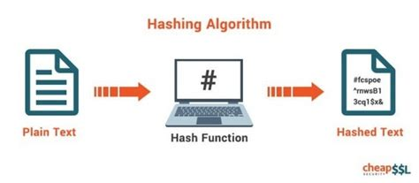

# KERI made easy
This page is an attempt to explain the benefits and urgency of `KERI` in plain people's language with lots of analogies and further reading.  
If you get lost, try the [definitions](#Definitions) below.

## What else helps better than to image you have to convince your imaginary *mother-in-law* of the usefulness of KERI?

# You can read this "KERI MADE EASY" as a conversation top down

### Who is Carry? Are you messing around? 
KERI. Key Event Receipt Infrastructure. Not something to mess around with.

### Why are you spending so much time with KERI? 
It's revolutionairy technology and has the ability to repair the internet. The internet is broken. You can't trust the entities you're interacting with on the web. We use cryptography, a secret language, to keep things private and under control. It's laid out in our [White Paper](https://github.com/SmithSamuelM/Papers/blob/master/whitepapers/KERI_WP_2.x.web.pdf).

### Who got laid? Have you been watching Crypto Porn and been using white paper??! You dirt bag, you... 
That's a misunderstanding. Let's take it slowly. {Here the story of how KERI came about, resulting in the whitepaper and links to educational sources, like on keri.one }

### What’s the problem KERI is going to solve? 
There is no spanning trust layer for the internet, based on identifiers that are under control of the entities involved. Entities like us indivdual human beings, but als organisation, machines, things, and even software code (smart contracts and oracles, but forget about them). 

Let's keep it simple: individual identifiers. Did you know: You don't own your Facebook account, you don't own the money in your bank account, you don't own the bitcoin in your exchange, etc. Apart from that you don't control them. So you might feel strong and powerful, mommy, but in fact you're not; as a digital identity, I mean of course.
When we get fed up with certain service and it's toe crunching privacy breaches, e.g. Facebook, you'd like to take your digital 'you' with you. And not only you, but also your network, your history of posts, messages, transactions etc. You know what: you can't nowadays. KERI is the eligible to get it done fundamentally right and future proof. 

Besides that we want to be able to prove that we are who we say we are in the digital world, anywhere and at all times. And be in control of that identifier. \
Image your Twitter-account is copied by aunty Geraldine, imposing as you on the web. She posts all these unvealing things about the bridge club in your name. You don't want that, do you? And Twitter might also shut off your real account, because they've been convinced by aunty Geraldine, that the imposting account she controls, is 'you'. You don't want that even more. Do you?

### Wait a minute, ‘Keribberish!’, What is that you're trying to tell me? 
{Explain in more detail what we are going to solve practically and urgently}

### So what’s the whole point if your KERI does what others do too?! 

Sorry, it’s complicated, please hold on. What just happened with KERI is *a great reset in thinking about trust that you can control your digital self by yourself* we’ve had this for some years already. We just needed time to put them together the right way. The building blocks just need to be assembled in an unprecedented way.  
Features:  
1.	Privacy.  Anonymize your statements and your data.
2.	Speed.  Provide information more quickly and at a higher rate due to the use of a local database of small infrastructure.
3.	Reliability. Verfiable information to root of coming into existance; making connected data more trustworthy.
4.	Self-sovereignty. Control your identifier. 
5.  Verifiable statements. Offer statements that are shareable and someone can confirm the statement without revealing what statement they are confirming. It's a kind of `zero knowledge proof`.

### "Wow, impressive list, but that last feature description ruined it!" 
#### This is total gibberish “self-certifying self-administering identifier”, etc. *What have you been smoking?!* 
Sorry again, no soft drugs involved. Let me try to give you a real life example:

##### Right now, if I sign a letter on paper with my signature and give it to you, and you give it to John, John doesn’t know you just didn’t create a signature of your own. He needs to independently verify it. Now suppose we just solved that ages old problem: John can verify the chain of digital signatures that is inherently associated with KERI.

And it’s getting even better! You could delegate your Autonomic ID, rotate your keys and even create complex multi-signature schemes.

### "You nerds are scary folks. _Autonomic weapons_. Can't you explain it to me, using an every day's tool, like a box of matches." 

Alright, a box of matches. Let me see....

##### {Story here with a match box}

The analogy with real world encryption: The matchbox is a secret master key, that has public keys (matches). Senders and receivers use digital messages through peer to peer networks.

### "OK, so your new _autonomous identity thing_ is known by the government and the banks and the police?" 

KERI wants to avoid `subject=person` statements for now. That means, we do not facilitate what so many other solutions instead will do: reveal counterparties in a group of people that interact with eachother. *We don't reveal people's identities to others, the subject/controller does self-sovereignly.*

### Why is revealing your identity a problem? I am not interested in anonymity, I’ve got nothing to hide! 

This is a well-know misconception. A few analogies of anonymity:
`Anonymization` is like pixelating someone’s face in a video. You can still hear what they say, but you don’t know who they are. It’s like footprints in the sand. After a period of time (that depends on the policy of your search engine), a wave comes in and wipes out each visitor’s footprints. [Source](https://sidewaysdictionary.com/#/term/anonymization)

For those who have the opinion that they don't care about anonymity, we have a closely related counter-question: 

If you don't care about anonymity, would you then care for your `privacy`? If so, then you care about anonymity too, because `privacy` is built on a foundation of anonymity)?
What you’ve got to hide, are the wrong conclusions drawn from the sensitive data that describe you.

This is the whole point of sovereignty. `Self-sovereignty` means that you are for an important part in charge of your own data; like you are in charge of your own body and mind.

### We're getting lost; where comes `KERI` into play? 

After you get used to secret keys to protect yourself, to enable yourself in the digital world and to control your digital identity, related data and transactions with these keys.

“I will transfer my identifier to you” is also an important use, that hasn't been able uniformly, so far.

### Keys, keys, keys, I get sick of keys and passwords and such! 
Now it’s our turn to ask _‘what have you been smoking?’_. Or for those who have lived under a rock, a short introduction to our 21th century world:

1. [The social dilemma](https://www.thesocialdilemma.com); documentary film: The technology that connects us, also controls us.
2. [Borderless world](https://www.citizen.org/article/privacy-needs-protection-in-a-borderless-world/)

If you still hang on, or caught up with me, these insights lead to the *new digital world’s* version of the example already laid out above:

##### “Right now, if I sign something and give it to you, and you give it to John, John doesn’t know you just didn’t create a secret KEY of your own. He needs to independently verify it.

### Phew, why not call a computer that neatly verifies for you, forget all your KERIing around? 

If we'd use an `API` we would have to trust the service party. Before you get started about APIs, here some analogies what an API does: 
**It’s like the connectors on the back of your TV**. They let you plug in a device from another manufacturer (DVD player, games console, set-top box) and both the TV and the device know what to do next. The connectors are the interface that lets one machine talk to another.    
**It's like a waiter at a restaurant**. The waiter takes a guests' food order, then delivers to the food order to the kitchen staff. The kitchen staff then makes the food, hands the food to the waiter, and then the waiter delivers the correct food order back to the guest.  [Source](https://sidewaysdictionary.com/#/term/API)

So for our purpose API and external service just won't do. Because we have to trust third parties and our identity could be revealed or abused in the process to others.

### Okay, got it: it's great, it's new, it's relevant, but can I eat, can I wear it, can I ride it? 

I agree we need to explain some better use cases.

`Proof of Certification` is one of the first. “This grade was achieved by subject and verified by this educational organisation on this date”. As a verifier you don't need more than the Key Event Log containing that string events, whereas in the traditional way of presenting a paper certificate, you have to trust / validate the credential, the subject and the issuer. KERI solves this problem once and for all for validator at Human Resource departments of employers.

But later we can do other kinds of service: 
**direct method** : “We exchange proofs of transaction either way (money for goods and vice versa) without having to trust any intermediate party or blockchain. 
**indirect nethod** : "Because I am not always online I have my identifier's history served by online Witnesses. Your validator can do duplicity detection on those witnesses and validate whether or not I am being duplicitous"

In fact through **KERI** flow anonymous `events`, it registered their proofs and their signatures. Some entity complies itself with that proof at that point in time. 

### DUPLICITOUS?! You're cheating? Lying? 
Being dupicitous means that a certain identifier has provenly made double statement about the same fact or event. You can't trust that identifier anymore from that time on. Cheating or lying is a value statement, a judgement. Being duplicitous is a mere fact.

### Touching, all of that, but hey son, time's running out... can I earn money with KERI? How. Quick. 

It integrates well with the DID - methods framework. Another angle could be monitoring that two or more entities from the same logical entity (e.g. a futures trading company) do not interfere with eachother on a public exchange. Example: Division A shorts an assets that division B has just insured against going bust.

It's obvious if Division A and B would become aware of eachothers identifiers and the outside world would not, that a great efficiency improvement can be established.

## GO CALL THEM, MOM! :)

## Definitions
In Alphabetic order

#### Ambient verifiability
Verifiable by anyone, anywhere, at anytime. E.g. Ambient Duplicity Detection describes the possibility of detecting duplicity by anyone, anywhere, anytime.

#### Agent
A representative for an _identity_. MAY require the use of a_wallet_. MAY support _transfer_

#### Agency
Agents can be people, edge computers and the functionality within [`wallets`](#digital-identity-wallet). The service an agent offers is agency.

#### Anonymity
Anonymity describes situations where the acting person's identity is unknown. Some writers have argued that namelessness, though technically correct, does not capture what is more centrally at stake in contexts of anonymity. The important idea here is that a person be non-identifiable, unreachable, or untrackable. Anonymity is seen as a technique, or a way of realizing, a certain other values, such as privacy, or liberty. Over the past few years, anonymity tools used on the dark web by criminals and malicious users have drastically altered the ability of law enforcement to use conventional surveillance techniques. [Know more](https://en.wikipedia.org/wiki/Anonymity#Pseudonymity)

#### Autonomic Identifier
An identifier that is self-certifying and self-sovereign

#### Claim
An assertion of the truth of something, typically one which is disputed or in doubt. A set of claims might convey personally identifying information: ½name, address, date of birth and citizenship, for example. ([Source](https://www.identityblog.com/?p=352)).

#### Cryptocurrency
A digital asset designed to work as a medium of exchange wherein individual coin ownership records are stored in a digital ledger or computerized database using strong cryptography to secure transaction record entries, to control the creation of additional digital coin records. See [more](https://en.wikipedia.org/wiki/Cryptocurrency)

#### Decentralized Identity
DID; Decentralized identity is a technology that uses cryptography to allow individuals to create and control their own unique identifiers. They can use these identifiers to obtain `Verifiable Credentials` from trusted organisations and, subsequently, present elements of these credentials as proof of claims about themselves. In this model, the individual takes ownership of their own identity and need not cede control to centralized service providers or companies.

`KERI`s definition of decentralization (centralization) is about _control_ not _spatial distribution_. In our definition _decentralized_ is not necessarily the same as _distributed_. By distributed we mean that activity happens at more than one site. Thus decentralization is about _control_ and distribution is about _place_. To elaborate, when we refer to decentralized infrastructure we mean infrastructure under decentralized (centralized) control no matter its spatial distribution. Thus _decentralized infrastructure_ is infrastructure sourced or controlled by more than one `entity`.

#### DID - Decentralized Identifier
A new type of globally unique identifier (URI) that does not require a centralized registration authority because control of the identifier can be proved using cryptography. 

#### Duplicity
In `KERI` consistency is is used to described data that is internally consistent and cryptographically verifiably so. Duplicity is used to describe **external inconsistency**. Publication of two or more versions of a `KEL` log, each of which is internally consistent is duplicity. Given that signatures are non-repudiable any duplicity is detectable and provable given possession of any two mutually inconsistent versions of a `KEL`.  

In common language 'duplicity' has a slightly different connotation: 'two-facedness', 'dishonesty', 'deceitfulness', 'deviousness,'two-facedness', 'falseness'.
#### End verifiable
If a log is end verifiable, this means that the log may be verified by any end user that receives a copy. No trust in intervening infrastructure is needed to verify the log and validate the content. 

#### Entropy
Unpredictable information. Often used as a _secret_ or as input to a _key_ generation algorithm.[More](https://en.wikipedia.org/wiki/Entropy_(information_theory))

The term entropy is also used to describe the degree of unpredictability of a message. Entropy is then measured in bits. The degree or strength of randomness determines how difficult it would be for someone else to reproduce the same large random number. This is called _collision resistance_. 

#### Entity
Entities are not limited to natural persons but may include groups, organizations, software agents, things, and even data items. 

#### Hash
A hash is a function that converts one value to another. Hashing data is a common practice in computer science and is used for several different purposes. Examples include cryptography, compression, checksum generation, and data indexing.

Hashing is a natural fit for cryptography because it masks the original data with another value. A hash function can be used to generate a value that can only be decoded by looking up the value from a hash table. The table may be an array, database, or other data structure. A good cryptographic hash function is non-invertible, meaning it cannot be reverse engineered.

Since hashed values are generally smaller than the originals, it is possible for a hash function to generate duplicate hashed values. These are known as "collisions" and occur when identical values are produced from different source data. Collisions can be resolved by using multiple hash functions or by creating an overflow table when duplicate hashed values are encountered. Collisions can be avoided by using larger hash values.

#### Inconsistency
If a reason, idea, opinion, etc. is inconsistent, different parts of it do not agree, or it does not agree with something else. Data inconsistency occurs when similar data is kept in different formats in more than onFBTe file. When this happens, it is important to match the data between files. 

#### Identity
A unique entity. Typically represented with a unique identifier.

#### Internal inconsistency
In KERI we are protected against Internal inconsistency by the hash chain datastructure of the `KEL`, because the only authority that can sign the log is the controller itself. 

#### Key
A mechanism for granting or restricing access to something. MAY be used to issue and prove, MAY be used to transfer and control over _identity_ and _cryptocurrency_. [More](https://en.wikipedia.org/wiki/Key_(cryptography))

#### Key Event
A data structure that consist of a header (Key Event header), a configuration section (Key Event Data spans Header and configuration) and signatures (Key event Message spans Data and signatures)\
(_@henkvancann_)

#### Key Event Log
Hash-chained Key Events, these are blockchains in a narrow definition, but not in the sense of ordering (not ordered) or global consensus mechanisms (not needed).
_(SamMSmith)_

#### Key Event Receipt Log
Signed Key Events, keeping track of establishment events. To begin with the inception event and any number of rotation events. We call that the _establishment subsequence_. \
(_@henkvancann_)

_(SamMSmith)_

#### Non-transferable identifier
And identifier of which you can't rotate its controlling private key. When the private key for a non-transferable identifier become exposed to potential compromise then the identifier must be abandoned by the controller as it is no longer secure.  

The main innovation of KERI is that it provides a universal decentralized mechanism that supports *both* non-transferable and more importantly transferable self-certifying identifiers.

#### Privacy
Privacy is a fundamental right, essential to autonomy and the protection of human dignity, serving as the foundation upon which many other human rights are built.
Privacy enables us to create barriers and manage boundaries to protect ourselves from unwarranted interference in our lives, which allows us to negotiate who we are and how we want to interact with the world around us. Privacy helps us establish boundaries to limit who has access to our bodies, places and things, as well as our communications and our information. [Source](https://www.privacyinternational.org/explainer/56/what-privacy) [Know more](https://medium.com/fortknoxster/what-is-privacy-and-why-does-it-matter-8648b2b8a297)

#### Public Key Infrastructure
A public key infrastructure (PKI) is a set of roles, policies, hardware, software and procedures needed to create, manage, distribute, use, store and revoke digital certificates and manage public-key encryption. [Wikipedia].(https://en.wikipedia.org/wiki/Public_key_infrastructure)

#### Pseudonymity
Pseudonymity is the state of being identified by a pseudonym, that is by a name, which is not somebody’s real, correct name. Furthermore, being pseudonymous in virtual communities means bearing a set of false distinctive characteristics, such as name and title that are used for identification and to some degree for interaction of the person concerned. The property that a user cannot be identified within the total user population, but her interactions nevertheless be tracked. [Source](https://www.igi-global.com/dictionary/privacy-digital-world/23971)

#### Root of trust
Replace human basis-of-trust with cryptographic root-of-trust. With verifiable digital signatures from asymmetric key cryptography we may not trust in “what” was said, but we may trust in “who” said it.\
The root-of-trust is consistent attribution via verifiable integral non-repudiable statements.

#### Secret
Information controlled by an identity. MAY be used to derive _key_s.

#### Self Sovereign Identity
SSI is a new model for Internet-scale digital identity based on an emerging set of protocols, cutting edge cryptography and open standards. Technological and social movements have come together that make SSI possible. ([Source](https://livebook.manning.com/book/self-sovereign-identity/chapter-1/v-8/14)).\
Decentralisation of the `root-of-trust` and `verifiable credentials` come into play and delivers  “user-centric identity”: more control and self-determination of individuals, individuals machines and combinations of these, that identify as one.\
_(@henkvancann)_

#### SSI - Self-Sovereign Identity
SSI is the concept that people and businesses can store their own identity data on their own devices, and provide it efficiently to those who need to validate it, without relying on a central repository of identity data.
[Know more](https://bitsonblocks.net/2017/05/17/gentle-introduction-self-sovereign-identity/): A gentle introduction to self-sovereign identity

#### Subject
A digital subject: A person or thing represented or existing in the digital realm which is being described or dealt with. ([Source](https://www.identityblog.com/?p=352)).

#### Transfer
The process of changing the _controller_ of _cryptocurrency_, _identity_ or _verifiable credential_. MAY require the use of a _key_.

#### Transferable identifier
And identifier of which you can rotate its controlling private key. When the private key for a transferable identifier become exposed to potential compromise then control over the identifier may be transferred to a new key-pair to maintain security.

The main innovation of KERI is that it provides a universal decentralized mechanism that supports *both* non-transferable and more importantly transferable self-certifying identifiers.

#### Trust-over-IP
It's a term related to the effort of a foundation. The Trust over IP Foundation is an independent project hosted at Linux Foundation to enable the trustworthy exchange and verification of data between any two parties on the Internet. [More](https://trustoverip.org/about/faq/).

#### URI - Uniform Resource Identifier (URI)
 A string of characters that unambiguously identifies a particular resource. To guarantee uniformity, all URIs follow a predefined set of syntax rules, but also maintain extensibility through a separately defined hierarchical naming scheme (e.g. http://). -> [Know more](https://en.wikipedia.org/wiki/Uniform_Resource_Identifier)

#### Validator
a _validator_ is anybody that wants to estblish control-authority over an identifier, created by the controller of the identifier. Validators verify the log, they apply duplicity detection or they leverage somebody else's duplicity detection or apply any other logic so they can say "Yes these are events I can trust".

During validation of virtual credentials for example, a `verifier` checks to see if a `verifiable credential` (VC) has been signed by the controller of this VC using the applicable verification method.

#### Verifiable Credential
Also VC; A data model for conveying claims made by an issuer about a subject. See [vc-data-model](https://www.w3.org/TR/vc-data-model/) for more.

Credentials are a part of our daily lives; driver's licenses are used to assert that we are capable of operating a motor vehicle, university degrees can be used to assert our level of education, and government-issued passports enable us to travel between countries. This specification provides a mechanism to express these sorts of credentials on the Web in a way that is cryptographically secure, privacy respecting, and machine-verifiable. [Know more](https://www.w3.org/TR/vc-data-model/)
 
 #### ZKP - Zero Knowledge Proof
ZKP is a method to prove the data without actually revealing the data. The person you’re proving to, doesn’t learn anything more than the bare fact that you’re proving. [Know more](https://medium.com/@pranshurastogi/zero-knowledge-proofs-a-method-to-conserve-privacy-1b072222ac1a) and analogies.

### Acknowledgements

[Mother in law demanding jump through burning ring - picture source](https://www.zawaj.com/askbilqis/my-mother-in-law-making-my-life-hell/)

[[Mother in law scolding - picture source](http://www.clipartpanda.com/categories/mother-in-law-20clipart)