# Q&A about KERI


**The questions are of a varied level: basic and detailed. The answers are mostly directed towards generally interested people and newbies.**

Why should you read or step through the Q&A? To get a different angle to the same topic: KERI.


```
{TBW} means: to be written
{TBW prio 1} means to be written with the highest priority, 3 = no urgency, 2 = intermediate}
```
- [Q&A about KERI](#qa-about-keri)
    + [Disclaimer](#disclaimer)
    + [List of questions and definitions](#list-of-questions-and-definitions)
  * [Knowledge you should be confidently applying](#knowledge-you-should-be-confidently-applying)
  * [Actions you should be comfortable with](#actions-you-should-be-comfortable-with)
- [Jump table to categories](#jump-table-to-categories)

Inspired by presentation given and questions asked on the [SSI webinar May 2020](https://ssimeetup.org/key-event-receipt-infrastructure-keri-secure-identifier-overlay-internet-sam-smith-webinar-58/), but also issues raised and the progress made, here on Github (Turn on 'Watch' if you want to be notified of conversations).

Beware: A Q&A is always *work in progress*. Tips & help welcome.


### Disclaimer
None of the respondents in the **open** repo and presentations have been explicitly named as a source, except for ***Samuel M. Smith Ph.D.*** and ***@henkvancann***. If there is no reference added to the answers, then it's Samuel M. Smith who answered the question. Most of the editing is done by @henkvancann, which might have introduced ommission, errors, language glitches and such. Sorry for that, feel free to correct by submitting a pull request (PR).\
For practical reasons educational images uploaded by Github members have been downloaded. We de-personalised them by giving images a new name. Under these new names these images have been uploaded to github and used in the Q&A to clarify the questions and answers.

Keri's content is licensed under the [CC by SA 4.0. license](https://creativecommons.org/licenses/by-sa/4.0/). Parts of the video offered on SSI Meetup webinar 58 have been captured and uploaded to Github to support the answers to general questions about digital identity and more in depth answers to question about Keri.

We've done our best to protect the privacy of the Github by investigating the images we used. We haven't come across personal identifiable information (pii). However, should we have made a mistake after all, please let us know and we'll correct this immediately.

### List of questions and definitions

- [Definitions:](#definitions)
      - [Ambient verifiability](#ambient-verifiability)
      - [Agent](#agent)
      - [Agency](#agency)
      - [Autonomic Identifier](#autonomic-identifier)
      - [Autonomic Namespace](#autonomic-namespace)
      - [Autonomic idenity system](#autonomic-idenity-system)
      - [Content-addressable hash](#content-addressable-hash)
      - [Controller](#controller)
      - [Correlation](#correlation)
      - [Cryptocurrency](#cryptocurrency)
      - [Decentralized Identity](#decentralized-identity)
      - [Derivation code](#derivation-code)
      - [Duplicity](#duplicity)
      - [Entropy](#entropy)
      - [Establishment Event](#establishment-event)
      - [End verifiable log](#end-verifiable-log)
      - [Entity](#entity)
      - [External consistency](#external-consistency)
      - [Inception Event](#inception-event)
      - [Inconsistency](#inconsistency)
      - [Identity](#identity)
      - [Internal inconsistency](#internal-inconsistency)
      - [KERI Agreement Algorithm for Control Establishment](#keri-agreement-algorithm-for-control-establishment)
      - [Key](#key)
      - [Key Event Log](#key-event-log)
      - [Key Event Receipt Log](#key-event-receipt-log)
      - [Non-Establishment Event](#non-establishment-event)
      - [Payload](#payload)
      - [Public Key Infrastructure](#public-key-infrastructure)
      - [Root of trust](#root-of-trust)
      - [Seal](#seal)
      - [Secret](#secret)
      - [Self Addressing Identifier](#self-addressing-identifier)
      - [Self Certifying Identifier](#self-certifying-identifier)
      - [Self Sovereign Identity](#self-sovereign-identity)
      - [Spanning layer](#spanning-layer)
      - [Transfer](#transfer)
      - [Trust-over-IP](#trust-over-ip)
      - [Validator](#validator)
      - [Verifiable Credential](#verifiable-credential)
      - [W3C DID](#w3c-did)
      - [(Digital Identity) Wallet](#-digital-identity--wallet)

- [Q&A section General](#qa-section-general)
  * [What is KERI?](#what-is-keri)
  * [Is KERI a DID?](#is-keri-a-did)
  * [Why use KERI?](#why-use-keri)
  * [Who is KERI? Is it a company or a not for profit?](#who-is-keri--is-it-a-company-or-a-not-for-profit)
  * [In what programming languages is KERI available?](#in-what-programming-languages-is-keri-available)
  * [How KERI fit in the 10 principles of SSI by Christopher Allen?](#how-keri-fit-in-the-10-principles-of-ssi-by-christopher-allen)
- [Q&A section KERI operational](#qa-section-keri-operational)
  * [Where can I download KERI?](#where-can-i-download-keri)
  * [Where can we find the code and how could a coder get started?](#where-can-we-find-the-code-and-how-could-a-coder-get-started)
  * [What would you see as the main drawback of KERI?](#what-would-you-see-as-the-main-drawback-of-keri)
  * [How can it be one solution, fit for all SSI problems?](#how-can-it-be-one-solution--fit-for-all-ssi-problems)
  * [Where you would need something quite different than KERI?](#where-you-would-need-something-quite-different-than-keri)
  * [How does KERI scale](#how-does-keri-scale)
  * [How are KERI witnesses and watchers incentived to spread KELs and KERLs and make them available?](#how-are-keri-witnesses-and-watchers-incentived-to-spread-kels-and-kerls-and-make-them-available)
  * [How to handle multiple formats of KEL and KERL through time. Will they be backwards compatible?](#how-to-handle-multiple-formats-of-kel-and-kerl-through-time-will-they-be-backwards-compatible)
  * [Could a KEL or KERL be pruned or charded?](#could-a-kel-or-kerl-be-pruned-or-charded)
  * [How to bootstrap KERI on the internet? Is it like fax machine; the more there are the more effective it is?](#how-to-bootstrap-keri-on-the-internet--is-it-like-fax-machine--the-more-there-are-the-more-effective-it-is)
  * [Why does KERI demand signing and digesting the full over-the-wire serialization of a message?](#why-does-keri-demand-signing-and-digesting-the-full-over-the-wire-serialization-of-a-message)
- [Q&A section Userinterface](#qa-section-userinterface)
  * [What does KERI look like?](#what-does-keri-look-like)
  * [Is there a KERI course or webinar available?](#is-there-a-keri-course-or-webinar-available)
  * [Could Keri work for edge computers that need self sovereign identity? How to (selectively) share control over the `SCI`/`SAI` with the owners of the device?](#could-keri-work-for-edge-computers-that-need-self-sovereign-identity--how-to--selectively--share-control-over-the--sci---sai--with-the-owners-of-the-device)
- [Q&A section Root of trust](#qa-section-root-of-trust)
  * [What do I need to trust in KERI?](#what-do-i-need-to-trust-in-keri)
    + [What is the difference between a trust basis and a trust domain?](#what-is-the-difference-between-a-trust-basis-and-a-trust-domain)
  * [KERI does not need a blockchain, but how does it establish the root-of-trust that we need for SSI? How does the data persist?](#keri-does-not-need-a-blockchain--but-how-does-it-establish-the-root-of-trust-that-we-need-for-ssi--how-does-the-data-persist)
- [Q&A section Why the internet is broken](#qa-section-why-the-internet-is-broken)
  * [Why would the internet be broken?](#why-would-the-internet-be-broken)
  * [How can the internet be fixed?](#how-can-the-internet-be-fixed)
  * [What's wrong with SSL certificate intermediairies?](#what-s-wrong-with-ssl-certificate-intermediairies)
  * [What's DNS Hijacking](#what-s-dns-hijacking)
  * [What is 'platform locked trust' and why should we bother?](#what-is--platform-locked-trust--and-why-should-we-bother)
  * [How to repair the internet trust layer?](#how-to-repair-the-internet-trust-layer)
  * [What role does KERI play in the suggested "repair of the internet"?](#what-role-does-keri-play-in-the-suggested--repair-of-the-internet)
- [Q&A section Identifiers](#qa-section-identifiers)
  * [How is a KERI identifier different than a regular identifier in DID methods?](#how-is-a-keri-identifier-different-than-a-regular-identifier-in-did-methods)
  * [Is my KERI identifier public?](#is-my-keri-identifier-public)
  * [Is a KERI identifier GPDR proof?](#is-a-keri-identifier-gpdr-proof)
  * [What do I need a self-certifying identifier for?](#what-do-i-need-a-self-certifying-identifier-for)
  * [What do I need a self-addressing identifier for?](#what-do-i-need-a-self-addressing-identifier-for)
  * [What do I need a multi-sig self-addressing identifier for?](#what-do-i-need-a-multi-sig-self-addressing-identifier-for)
  * [What do I need a delegated self-adressing identifier for?](#what-do-i-need-a-delegated-self-adressing-identifier-for)
  * [What do I need a self-signing identifier for?](#what-do-i-need-a-self-signing-identifier-for)
- [Q&A section Event logs](#qa-section-event-logs)
  * [What is a Key Event Log?](#what-is-a-key-event-log)
  * [Why is a Key Event Log crucially important?](#why-is-a-key-event-log-crucially-important)
  * [How do I create a KEL?](#how-do-i-create-a-kel)
  * [How can I trust a KEL?](#how-can-i-trust-a-kel)
- [Q&A section Inconsistency and duplicity](#qa-section-inconsistency-and-duplicity)
  * [What kind of Inconsistencies do we have?](#what-kind-of-inconsistencies-do-we-have)
  * [What is Duplicity?](#what-is-duplicity)
  * [Why should we care about Duplicity?](#why-should-we-care-about-duplicity)
- [Q&A section Key rotation](#qa-section-key-rotation)
  * [What is Key Rotation?](#what-is-key-rotation)
  * [Why bother about key rotation?](#why-bother-about-key-rotation)
- [Q&A section KEL and KERL](#q-a-section-kel-and-kerl)
  * [What the difference between KEL and KERL?](#what-the-difference-between-kel-and-kerl)
- [Q&A section Wallets](#qa-section-wallets)
  * [Why do I need a wallet for KERI?](#why-do-i-need-a-wallet-for-keri)
  * [How can I backup the KERI identifiers in my wallet?](#how-can-i-backup-the-keri-identifiers-in-my-wallet)
  * [Can I receive crypto money in my KERI wallet?](#can-i-receive-crypto-money-in-my-keri-wallet)
  * [Does a KERI wallet store virtual credentials connect to my identifiers?](#does-a-keri-wallet-store-virtual-credentials-connect-to-my-identifiers)
- [Q&A section Signatures](#qa-section-signatures)
  * [Who can sign off my proofs and identifiers?](#who-can-sign-off-my-proofs-and-identifiers)
  * [What is the practical use of signatures?](#what-is-the-practical-use-of-signatures)
  * [Do verifiers, validators, witnesses and watcher sign off `payloads`?](#do-verifiers--validators--witnesses-and-watcher-sign-off--payloads-)
- [Q&A section Proofs](#qa-section-proofs)
  * [What does KERI proof?](#what-does-keri-proof)
  * [Does KERI know whether any message in the Event Logs are valid or true?](#does-keri-know-whether-any-message-in-the-event-logs-are-valid-or-true)
  * [How can we verify that a statement by a controller is valid?](#how-can-we-verify-that-a-statement-by-a-controller-is-valid)
  * [How can we trust what was said or written?](#how-can-we-trust-what-was-said-or-written)
- [Q&A section Private Key Management](#qa-section-private-key-management)
  * [Not your keys, not your identity?](#not-your-keys--not-your-identity)
  * [The wallet is there to store my KERI private keys safely, no?](#the-wallet-is-there-to-store-my-keri-private-keys-safely--no)
  * [Are compound private keys (Shamir Secret Sharing) and multisignature schemes possible to incept identifiers?](#are-compound-private-keys--shamir-secret-sharing--and-multisignature-schemes-possible-to-incept-identifiers)
  * [How to delegate control over my private keys that control my identifiers?](#how-to-delegate-control-over-my-private-keys-that-control-my-identifiers)
- [Q&A section Blockchain](#qa-section-blockchain)
  * [Does KERI use a blockchain?](#does-keri-use-a-blockchain)
  * [What's the difference between KERI and blockchain?](#what-s-the-difference-between-keri-and-blockchain)
  * [Why not register identities on an open public ledger like bitcoin, ethereum or soverin?](#why-not-register-identities-on-an-open-public-ledger-like-bitcoin--ethereum-or-soverin)
- [Q&A section Agencies](#qa-section-agencies)
  * [How can KERI offer consistent services and truth?](#how-can-keri-offer-consistent-services-and-truth)
- [Q&A section Witness](#qa-section-witness)
  * [Witnesses have no skin in the game, it’s a `nothing at stake` situation, no?](#witnesses-have-no-skin-in-the-game--it-s-a--nothing-at-stake--situation--no)
  * [As long as witnesses keep lying together no one will ever be able to prove them wrong?](#as-long-as-witnesses-keep-lying-together-no-one-will-ever-be-able-to-prove-them-wrong)
- [Q&A section Watchers](#qa-section-watchers)
  * [How can we detect duplicity? Suppose controller has power over witnesses.](#how-can-we-detect-duplicity--suppose-controller-has-power-over-witnesses)
- [Q&A Virtual Credentials](#qa-virtual-credentials)
  * [Why doesn't KERI use certification as a root of trust?](#why-doesn-t-keri-use-certification-as-a-root-of-trust)

<small><i><a href='http://ecotrust-canada.github.io/markdown-toc/'>Table of contents generated with markdown-toc</a></i></small>

## Knowledge you should be confidently applying
- The definitions above
- Public private key pairs
- Bitcoin Improvement Protocols: BIP32, BIP39, BIP44, BIP47, BIP49, BIP84, BIP174
- hierarchical deterministic derivation paths
- Base58
- Eliptic curves
## Actions you should be comfortable with
- Amend knowledge and keep existing knowledge up to date
- create a key pair safely and back it up safely
- recover from a seed
- sweep to a new wallet

# Jump table to categories
- [General](#qa-section-general)
- [KERI operational](#qa-section-keri-operational)
- [Userinterface](#qa-section-userinterface)
- [Root of trust](#qa-section-root-of-trust)
- [Why the internet is broken](#qa-section-why-the-internet-is-broken)
- [Identifiers](#qa-section-identifiers)
- [Event logs](#qa-section-event-logs)
- [Inconsistency and duplicity](#qa-inconsistency-and-duplicity)
- [Key rotation](#qa-key-rotation)
- [KEL and KELR](#qa-section-kel-and-kerl)
- [Wallets](#qa-section-wallets)
- [Signatures](#qa-section-signatures)
- [Proofs](#qa-section-proofs)
- [Private Key Management](#qa-section-private-key-management)
- [Blockchain](#qa-key-blockchain)
- [Agencies](#qa-key-agencies)
- [Witness](#qa-section-Witness)
- [Watchers](#qa-section-watcher)
- [Virtual Credentials](virtual-credentials)

# Definitions

## Abbreviations
In alphabetic order:\
ACDC = Authentic Chained Data Container Task Force
AID = [Autonomic Identifier](#autonomic-identifier)\
AIS = [Autonomic Identity System](#autonomic-identity-system)\
AN = [Autonomic Namespace](#autonomic-namespace)\
DEL = [Duplicitous Event Log](#duplicitous-event-log)\
DID = [Decentralized Identity](#decentralized-identity) or Digital Identity dependent of the context.\
DIF = Decentralized Identity Foundation\
DDO = DID Document, look up W3D DID standardization for more info\
DHT = Distributed Hash Table\
DIF = Decentralized Identity Foundation, https://identity.foundation\
DKMI = Decentralized Key Mangement Infrastructure\
HSM = Hardware Security Module\
IPv4 = standard Internet Protocol, version 4\
KAACE = [KERI Agreement Algorithm for Control Establishment](#keri-agreement-algorithm-for-control-establishment)
KEL = [Key Event Log](#key-event-log)\
KERL = [Key Event Receipt Log](#key-event-receipt-log)\
KERI = [Key Event Receipt Infrastructure](#key-event-receipt-infrastructure)\
KID = [KERI Implementation/Improvement Docs](#keri-implementation-Improvement-docs)
LOA = [Levels Of Assurance](#levels-of-assurance)\
PKI = [Public Key Infrastructure](#public-key-infrastructure)\
PoA = Proof of Authority\
PR = Pull Request; github terminology\
SAI = [Self Addressing Identifier](#self-addressing-identifier)\
SCI = [Self Certifying Identifier](#self-certifying-identifier)\
SSI = [Self Sovereign Identity](#self-sovereign-identity)\
VC = Verifiable Credential, look up W3D DID standardization for more info\
WASM = [WebAssembly](#WebAssembly)


Definitions in alphabetic order:

#### Authentic Chained Data Container Task Force
The purpose of the Authentic Chained Data Container (ACDC) Task Force  is to draft a TSS (ToIP Standard Specification) that defines the standard requirements for the semantics of Authentic Provenance Chaining of Authentic Data Containers. [See more](https://wiki.trustoverip.org/display/HOME/ACDC+%28Authentic+Chained+Data+Container%29+Task+Force)

#### Ambient verifiability
Verifiable by anyone, anywhere, at anytime. E.g. Ambient Duplicity Detection describes the possibility of detecting duplicity by anyone, anywhere, anytime.

#### Agent
A representative for an _identity_. MAY require the use of a_wallet_. MAY support _transfer_

#### Agency
Agents can be people, edge computers and the functionality within [`wallets`](#digital-identity-wallet). The service an agent offers is agency.

#### Autonomic Identifier
An identifier that is self-certifying and self-sovereign

#### Autonomic Namespace
A namespace that is self-certifying and hence self-administrating. ANs are therefore portable = truly self sovereign.

#### Autonomic idenity system
In the design of an identity system you need to answer a few questions.

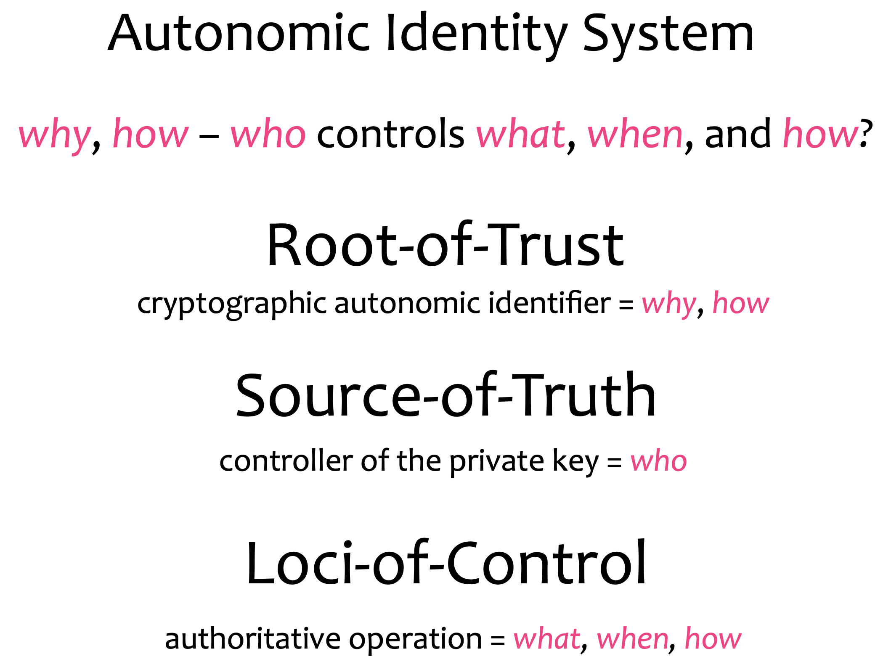

There's nobody that can intervene with the establishment of the authenticity of a control operation because you can verify all the way back to the root-of-trust.

#### Claim
An assertion of the truth of something, typically one which is disputed or in doubt. A set of claims might convey personally identifying information: ½name, address, date of birth and citizenship, for example. ([Source](https://www.identityblog.com/?p=352)).

#### Content-addressable hash
Content addressing is a way to find data in a network using its content rather than its location. The way we do is by taking the content of the content and hashing it. Try uploading an image to IPFS and get the hash using the below button. In the IPFS ecosystem, this hash is called Content Identifier, or CID.
#### Controller
The entity that has the ability to make changes to an _identity_, _cryptocurrency_ or v_erifiable credential_. 

The controller of an `autonomous identifier` is the entity (person, organization, or autonomous software) that has the capability, as defined by derivation, to make changes to an `Event Log`. This capability is typically asserted by the control of a single inception key. In DIDs this is typically asserted by the control of set of cryptographic keys used by software acting on behalf of the controller, though it may also be asserted via other mechanisms. In KERI an AID has one single controller. Note that a DID may have more than one controller, and the DID `subject` can be the DID controller, or one of them.

#### Correlation
An identifier used to indicate that external parties have observed how wallet contents are related. For example, when a public key is reused, it conveys that some common entity is controlling both identifiers. Tracking correlation allows for software to warn when some new information might be about to be exposed, for example: "Looks like you are about to send crypo currency, from an account you frequently use to a new account you just created."

#### Cryptocurrency
A digital asset designed to work as a medium of exchange wherein individual coin ownership records are stored in a digital ledger or computerized database using strong cryptography to secure transaction record entries, to control the creation of additional digital coin records. See [more](https://en.wikipedia.org/wiki/Cryptocurrency)

#### Decentralized Identity
DID; Decentralized identity is a technology that uses cryptography to allow individuals to create and control their own unique identifiers. They can use these identifiers to obtain `Verifiable Credentials` from trusted organisations and, subsequently, present elements of these credentials as proof of claims about themselves. In this model, the individual takes ownership of their own identity and need not cede control to centralized service providers or companies.

`KERI`s definition of decentralization (centralization) is about _control_ not _spatial distribution_. In our definition _decentralized_ is not necessarily the same as _distributed_. By distributed we mean that activity happens at more than one site. Thus decentralization is about _control_ and distribution is about _place_. To elaborate, when we refer to decentralized infrastructure we mean infrastructure under decentralized (centralized) control no matter its spatial distribution. Thus _decentralized infrastructure_ is infrastructure sourced or controlled by more than one `entity`.

#### Duplicitous event log
Or DEL. This is a record of _inconsistent_ event messages produced by a given controller or witness with respect to a given `KERL`. The duplicitous events are indexed to the corresponding event in a KERL. A duplicitous event is represented by a set of two or more provably mutually inconsistent event messages with respect to a KERL. Each `juror` keeps a duplicitous event log (DEL) for each controller and all designated witness with respect to a KERL. Any validator may confirm duplicity by examining a DEL.

#### Derivation code
To properly extract and use the `public key` embedded in a self-certifying identifier we need to know the cryptographic _signing scheme_ used by the key pair. KERI includes this very compactly in the identifier, by replacing the pad character (a character used to fill a void to able to always end up with a fixed length public key) with a special character that encodes the derivation process. Call this the derivation code.
```
For example suppose that the 44 character Base-64 with trailing pad charac- ter for the public key is as follows:
_F5pxRJP6THrUtlDdhh07hJEDKrJxkcR9m5u1xs33bhp=_
If B is the value of the derivation code then the resultant self-contained string is as follows:
_BF5pxRJP6THrUtlDdhh07hJEDKrJxkcR9m5u1xs33bhp_
```
All crypto material appears in `KERI` in a fully qualified representation that includes a derivation code prepended to the crypto-material.
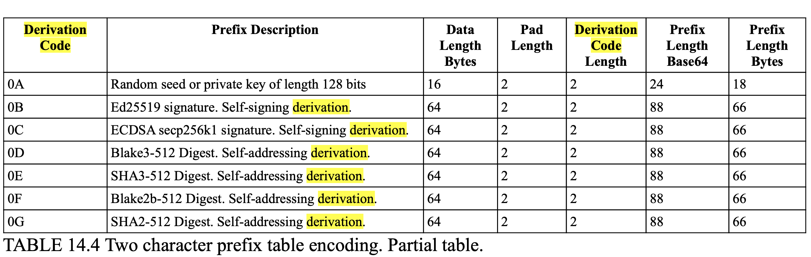

#### Duplicity
In `KERI` consistency is is used to described data that is internally consistent and cryptographically verifiably so. Duplicity is used to describe **external inconsistency**. Publication of two or more versions of a `KEL` log, each of which is internally consistent is duplicity. Given that signatures are non-repudiable any duplicity is detectable and provable given possession of any two mutually inconsistent versions of a `KEL`.  

In common language 'duplicity' has a slightly different connotation: 'two-facedness', 'dishonesty', 'deceitfulness', 'deviousness,'two-facedness', 'falseness'.
#### End verifiable
If a log is end verifiable, this means that the log may be verified by any end user that receives a copy. No trust in intervening infrastructure is needed to verify the log and validate the content. 

#### Entropy
Unpredictable information. Often used as a _secret_ or as input to a _key_ generation algorithm.[More](https://en.wikipedia.org/wiki/Entropy_(information_theory))

The term entropy is also used to describe the degree of unpredictability of a message. Entropy is then measured in bits. The degree or strength of randomness determines how difficult it would be for someone else to reproduce the same large random number. This is called _collision resistance_. 

#### Establishment Event
An event that establishes control authority. What are the authoritative key-pairs in any point in time. For a trivial system this is one authoritative keypair and it never changes. However, if we need persistance in our identifier and we want to be able to for example overcome compromise of our keys, we need to be able to do something like rotate keys.

#### End verifiable log
End verifiable logs on ambient infrastructure enables `ambient verifiability` (verifiable by anyone, anywhere, at anytime). We don't need the intermediate states of the log.

#### Entity
Entities are not limited to natural persons but may include groups, organizations, software agents, things, and even data items. 

#### Event sourced architecture
It is an Event driven architecture. However in Event Driven you can't ever replay an event.\
In the Event Sourced architecture you recreate states in an asynchronous way. That has in general great scaleability and resiliance characteristics. However, in KERI the driver for event sourcing is security.

#### External consistency
Two or more logs are _externally consistent_ if they are both verfiable internally consistent, to begin with, and the reported copies of the logs that are the same. 

External logs that are _inconsitent_, have at least two reported copies of the logs that are different. That means I have a duplicitous log. We need duplicity detection to be able to garantuee _external consistency_ or put in an different way: duplicity detection protects against external inconsistency.

#### Inception Event
Is a type of Establishment Event, it's the first event that establishes an identifier. \
(_SamMSmith_)
#### Inconsistency
If a reason, idea, opinion, etc. is inconsistent, different parts of it do not agree, or it does not agree with something else. Data inconsistency occurs when similar data is kept in different formats in more than onFBTe file. When this happens, it is important to match the data between files. 

#### Identity
A unique entity. Typically represented with a unique identifier.

#### Internal inconsistency
In KERI we are protected against Internal inconsistency by the hash chain datastructure of the `KEL`, because the only authority that can sign the log is the controller itself. 

#### Javascript Object Signing and Encryption
Or JOSE. JOSE is a framework intended to provide a method to securely transfer claims (such as authorization information) between parties. The JOSE framework provides a collection of specifications to serve this purpose. Related: `JWK`, `JWT`. [More info](https://jose.readthedocs.io/en/latest/)

#### KERI Agreement Algorithm for Control Establishment
{TBW}

#### Keridemlia
It is a contraction of KERI and [Kademlia](https://en.wikipedia.org/wiki/Kademlia). It's the distributed database of Witness IP-addresses based on a Distributed Hash Tabel. It also does the CNAME - stuff that DNS offers for KERI: the mapping between an identifier and it's controller AID stored in the KEL to its current wittness AID and the wittness AID to the IP address.\
(_@henkvancann_)

#### Key
A mechanism for granting or restricing access to something. MAY be used to issue and prove, MAY be used to transfer and control over _identity_ and _cryptocurrency_. [More](https://en.wikipedia.org/wiki/Key_(cryptography))

#### Key Event
A data structure that consist of a header (Key Event header), a configuration section (Key Event Data spans Header and configuration) and signatures (Key event Message spans Data and signatures)\
(_@henkvancann_)

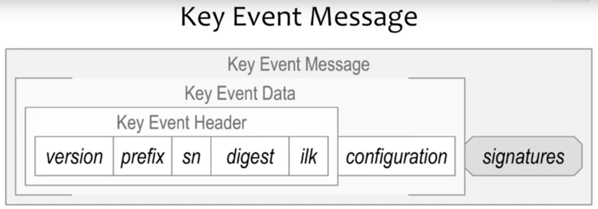

#### Key Event Log
Hash-chained Key Events, these are blockchains in a narrow definition, but not in the sense of ordering (not ordered) or global consensus mechanisms (not needed).
_(SamMSmith)_

#### Key Event Receipt Log
Signed Key Events, keeping track of establishment events. To begin with the inception event and any number of rotation events. We call that the _establishment subsequence_. \
(_@henkvancann_)

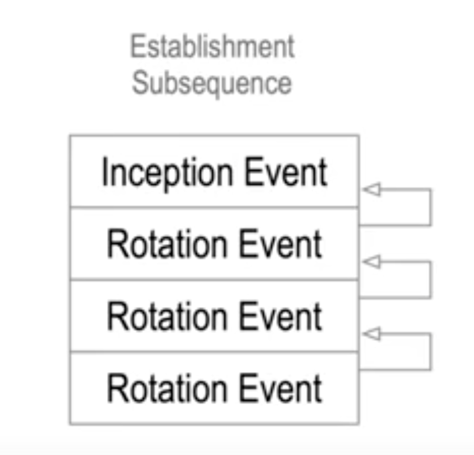

_(SamMSmith)_

#### Key Event State
Includes the mapping CNAME like, it also contain the witness data\
The KES is never signed by the controller of the AID\
{TBW}

#### KERI Implementation/Improvement Docs
Or KIDs. These docs are modular so teams of contributors can independently work and create PRs of individual KIDs; KIDs answer the question "how we do it". We add commentary to the indivudual KIDs that elaborate on the _why_. It has been split from the _how_ to not bother implementors with the _why_.

#### Level of Assurance
LOA; Identity and other trust decisions are often not binary. They are judgement calls. Any time that judgement is not a simple “Yes/No” answer, you have the option for levels of assurance.
KERI has the same LOAs for entropy and trust in human behaviour preservering the security of keypairs and preservering their own privacy. It has high LOAs for the cryptographical bindings of controllers and identifiers. Also the validation of witnesses and watchtowers has high a LOA.

#### Non-Establishment Event
To be able to do something with the identifier, it anchors data to the key event sequence. So you can so things like issue or revoke a verifiable credential or engage in a transaction in which you give a commitment of some form to some other entity and you can anchor that commitment to the KER log and make it verifiable that way.

#### Non-transferable identifier
And identifier of which you can't rotate its controlling private key. When the private key for a non-transferable identifier become exposed to potential compromise then the identifier must be abandoned by the controller as it is no longer secure.  

The main innovation of KERI is that it provides a universal decentralized mechanism that supports *both* non-transferable and more importantly transferable self-certifying identifiers.

#### Normative
In general, we call a theory “normative” if it, in some sense, tells you what you should do - what action you should take. If it includes a usable procedure for determining the optimal action in a given scenario. [Souce](https://www.quora.com/What-is-the-difference-between-normative-and-non-normative?share=1).

#### Non-normative
A theory is called non-normative if it does not do that. In general, the purpose of non-normative theories is not to give answers, but rather to describe possibilities or predict what might happen as a result of certain actions.
[Souce](https://www.quora.com/What-is-the-difference-between-normative-and-non-normative?share=1).

#### Payload
The term 'payload' is used to distinguish between the 'interesting' information in a chunk of data or similar, and the overhead to support it. It is borrowed from transportation, where it refers to the part of the load that 'pays': for example, a tanker truck may carry 20 tons of oil, but the fully loaded vehicle weighs much more than that - there's the vehicle itself, the driver, fuel, the tank, etc. It costs money to move all these, but the customer only cares about (and pays for) the oil, hence, 'pay-load'. [source](https://softwareengineering.stackexchange.com/questions/158603/what-does-the-term-payload-mean-in-programming).

Now payload in `KERI`. The payload of an item in an `Event Log` is one the following cryptographical building blocks in KERI:
- a content digest hash 
- a root hash of a Merkletree
- a public key
Note that the KERI never puts raw data or privacy sensitive data in a `KEL` or `KERL`.

#### Prefix
A prefix that is composed of a basic Base-64 (URL safe) derivation code prepended to Base-64 encoding of a basic public digital signing key.\
Including the derivation code in the prefix binds the derivation process along with the public key to the resultant identifier. 
```
An example of the prefix with a one character derivation code and a 32 byte public key encoded into a 44 character Based-64 string follows:
BDKrJxkcR9m5u1xs33F5pxRJP6T7hJEbhpHrUtlDdhh0.
```
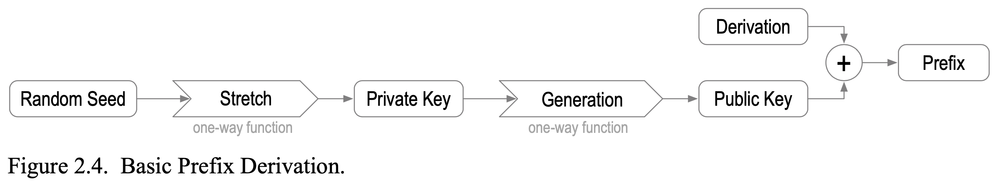

#### Public Key Infrastructure
A public key infrastructure (PKI) is a set of roles, policies, hardware, software and procedures needed to create, manage, distribute, use, store and revoke digital certificates and manage public-key encryption. [Wikipedia].(https://en.wikipedia.org/wiki/Public_key_infrastructure)

#### Race condition
A race condition or race hazard is the condition of an electronics, software, or other system where the system's substantive behavior is dependent on the sequence or timing of other uncontrollable events. It becomes a bug when one or more of the possible behaviors is undesirable. [Source](https://en.wikipedia.org/wiki/Race_condition).

#### Root of trust
Replace human basis-of-trust with cryptographic root-of-trust. With verifiable digital signatures from asymmetric key cryptography we may not trust in “what” was said, but we may trust in “who” said it.\
The root-of-trust is consistent attribution via verifiable integral non-repudiable statements.

#### Rotation Event
A type of `Establishment event` that allows to change to authoritative public key. So we start with a `root-of-trust` in public private key pair that get down to the identifier, and then we can rotate authoritatively to other keypairs given signed rotation messages. The infrastructure that we need, keeps track of these rotations, or `Key Event Receipt Infrastructure`.
_(SamMSmith)_
#### Seal
A seal is a cryptographic anchor that provides evidence of authenticity; we have:
1. Digist Event Seal
2. Hash tree root Seal
3. Event Seal
Seals deliver authenticity proofs in KERI.

#### Secret
Information controlled by an identity. MAY be used to derive _key_s.

#### Self Addressing Identifier
`SAI`, This is a self certfifying identifier (`SCI`) that has been attached to a certain context or infrastructure at the time of its inception. The inception configuration together with public key and it's `derivation`, forms a digest (hash) plus it's own `derivation code` that constitutes the Prefix of a self-addressing ID.

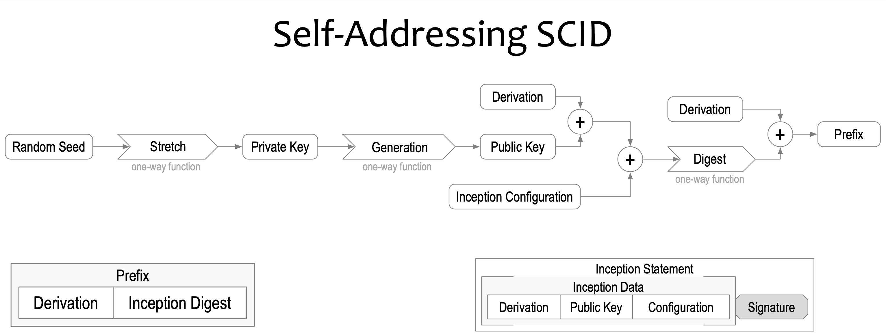

#### Self Certifying Identifier
In brief: A self-certifying identifier cryptographically binds an identifier to a key-pair.\
A controller issues an own Identifier by binding a generated public private keypair to an identifier. After this a controller is able to sign the identifier and create a certificate. Also called a _cryptonym_. The simplest form of a self-certifying identifier includes either the public key or a unique fingerprint of the public key as a `prefix` in the identifier.


The root-of-trust is fully cryptographic, there is no infrastructure associated with it. If we start there we can build a secure system on top of that. It means SCI gives us strong bindings between the keypair, the controller and the identifier. And so it fixes the main weakness of any administratively issued identifier asserting the binding between the keypair and the identifier and between the controller and the identifier, replacing them with all cryptographically strong bindings.

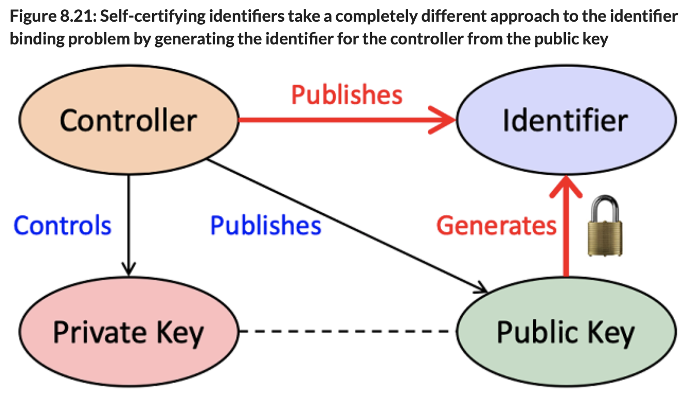

[Source](https://livebook.manning.com/book/self-sovereign-identity/chapter-8/v-9/141) is #SSI book.

#### Self Sovereign Identity
SSI is a new model for Internet-scale digital identity based on an emerging set of protocols, cutting edge cryptography and open standards. Technological and social movements have come together that make SSI possible. ([Source](https://livebook.manning.com/book/self-sovereign-identity/chapter-1/v-8/14)).\
Decentralisation of the `root-of-trust` and `verifiable credentials` come into play and delivers  “user-centric identity”: more control and self-determination of individuals, individuals machines and combinations of these, that identify as one.\
_(@henkvancann)_

#### Spanning layer
An all encompassing layer horizontal layer in a software architecture. Each trust layer only spans platform specific applications. It bifurcates the internet trust map. There is no spanning trust layer.
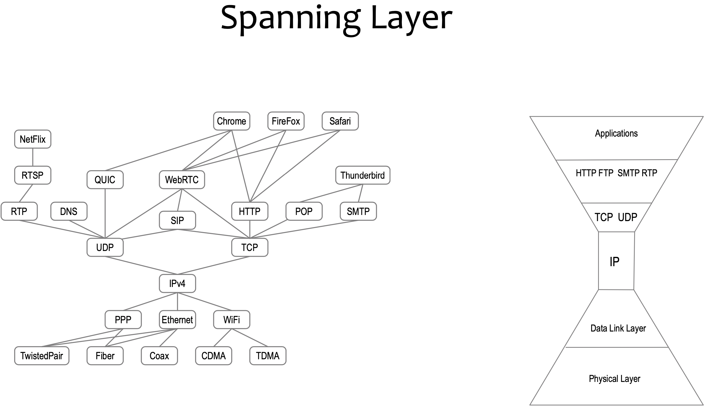

#### Subject
A digital subject: A person or thing represented or existing in the digital realm which is being described or dealt with. ([Source](https://www.identityblog.com/?p=352)).

#### Transfer
The process of changing the _controller_ of _cryptocurrency_, _identity_ or _verifiable credential_. MAY require the use of a _key_.

#### Transferable identifier
And identifier of which you can rotate its controlling private key. When the private key for a transferable identifier become exposed to potential compromise then control over the identifier may be transferred to a new key-pair to maintain security.

The main innovation of KERI is that it provides a universal decentralized mechanism that supports *both* non-transferable and more importantly transferable self-certifying identifiers.

#### Trust-over-IP
It's a term related to the effort of a foundation. The Trust over IP Foundation is an independent project hosted at Linux Foundation to enable the trustworthy exchange and verification of data between any two parties on the Internet. [More](https://trustoverip.org/about/faq/).

#### Validator
a _validator_ is anybody that wants to estblish control-authority over an identifier, created by the controller of the identifier. Validators verify the log, they apply duplicity detection or they leverage somebody else's duplicity detection or apply any other logic so they can say "Yes these are events I can trust".

During validation of virtual credentials for example, a `verifier` checks to see if a `verifiable credential` (VC) has been signed by the controller of this VC using the applicable verification method.

#### Verifiable Credential
VC; A data model for conveying claims made by an issuer about a subject. See [vc-data-model](https://www.w3.org/TR/vc-data-model/) for more.

#### W3C DID
The W3C consortium Decentralized ID standardization. [More](https://w3c.github.io/did-core/).

#### WebAssembly
WASM, or just WA) is an _open standard_ that defines a portable binary-code format for executable programs, and a corresponding textual assembly language, as well as interfaces for facilitating interactions between such programs and their host environment.\
The main goal of WebAssembly is to enable high-performance applications on web pages, but the format is designed to be executed and integrated in other environments as well, including standalone ones. [More info](https://en.wikipedia.org/wiki/WebAssembly).

#### (Digital Identity) Wallet
In our context it is software and sometimes hardware that serves as a key store and functionality. Keys can be private keys and public keys, hashes and pointers. Functionality can be signing, invoices (receive), send, virtual credentials, delegation, etc. This is the [`agency`](#agency) part of a wallet. \
[More about digital ID Wallets](https://www.thalesgroup.com/en/markets/digital-identity-and-security/government/identity/digital-identity-services/digital-id-wallet)\
[More about cryto Wallets](https://cryptocurrencyfacts.com/what-is-a-cryptocurrency-wallet/).

# Q&A section General

## What is KERI?
Key Event Receipt Infrastructure; a secure identifier overlay for the internet.

## Why use KERI?
Because there is no secure universal trust layer for the internet, currently (2020).\
KEI is both privacy preserving and context-independent extensible. That means KERI is interoperable accross areas of application on the internet. It does so securely, with minimal sufficient means.\
_(@henkvancann)_

## Is KERI a DID?
`KERI` is not a `DID` method. The proposed related `DID` method is [`did:un`](https://github.com/decentralized-identity/keri/blob/master/did_methods/un.md). A session at the recent **IIW31** presented by Jolocom’s *Charles Chunningham* examines overlap between data models of DID documents and `KERI` identifiers [here](https://jolocom.io/blog/as-seen-at-iiw31-keri/).\
However there are also votes for `did:keri`: _Drummond Reed_ (Dec 2 2020): "at IIW we asked that question and  feedback overwhelmingly favored did:keri. Furthermore, I’ve proposed that the keri namespace be reserved within the method-specific ID spaces of other DID methods as well, The Indy community has agreed to reserve the keri namespace in the Indy DID method."\
_(@henkvancann)_

## Some say that with KERI, a DID can be reduced to did:<identifier>. But that’s not a valid DID?!
_Every DID must have a method name component before the method-specific ID._

The first paper mentioning the absence of the method is [Thinking of DID? KERI On](https://humancolossus.foundation/blog/thinking-of-did-keri-on) by The Human Colossus Foundation, written by Robert Mitwicki. He addressed the concern in the question (the invalidity of the DID method) and made it more clear what the Foundation meant by that: "We look into the future and with that view we think that namespace could be dropped and we could keep only identifier, as the namespace seems to be one of the major drawbacks of decentralized identifiers at the moment. In my opinion `did:keri:<identifiers>`  would be just intermediate step as the issue addressed by post would still hold. We see that KERI could be a major upgraded for DID; not replacement."

## Is it possible to create a KERI DID that is permanently locked to the "did:key" style / ephemeral?
It is. Sections 2.2.3 - 2.3.1 of the [white paper](https://github.com/SmithSamuelM/Papers/blob/master/whitepapers/KERI_WP_2.x.web.pdf) explains transferrability and the "basic"-type identifier, which always represents a public key and may be either transferrable (can be updated) or non-transferrable (ephemeral/did:key style). section 14.2 actually details how these are encoded, basically check the first few chars of the identifier.\
_(CharlesCunningham)_

## Is it fair to say that DID resolution in general is a security weakness and then push forward KERI in that name? 
_Although some DIDs have not kept up with design goals* of DIDs, e.g. did:web, it is too strong to state this in general. It simply depends on the DID method?\
*decentralization, persistence, cryptographic verifiability._

In brief: we argue that the chain is as strong as its weakest ring.

Security is not build into the protocol but indeed as the eloborate question mentions, it depends on the DID method. Which overall is a huge risk for community as people needs to know the security level which each did method brings. From that perspective without unified security model brings us to the similar situation where, me having private email server in the basement to avoid spying by google, I send out my e-mail to you having it on gmail. I have high security and privacy but other side have just security without privacy. The outcome is that security model is applied in wrong place and KERI aims to fix it.\
_(RobertMitwicki)_

## Isn't it a bit arrogant of KERI to say "my new DID method is so good that it can replace all others for all eternity"?
_But by doing that you will also exclude a lot of existing identifier infrastructure._

I am not denying existence of existing DID infrastructure, but I agree a lot of them could be obsolete if we introduce KERI. A lot of business models which are build upon current model would be obsolete. I understand that a lot of people would not like that, but that is called progress.\
_(RobertMitwicki)_

## Because the DID data model theoretically allows DID methods and verification methods that may NOT be based on cryptographic keys, KERI is capable of spanning all DIDs?

We would like to see some examples of verification methods that are not based on cryptographic keys and are in the scope of DID. The KERI community would like to learn more about these methods. 
It's true KERI is all about cryptographic commitment. But KERI can also support hashed based identifiers e.g. a fingerprint of the content as unique identifier, without the control part.

## Could we see a `WASM` module in the near future for Sidetree and DID:peer interoperability?
 WASM is certainly on the roadmap, but for the main issue of Sidetree and did:peer interop, see the [core KERI spec repo issue](https://github.com/decentralized-identity/keri/issues/79) for more info.\
_(CharlesCunningham)_

## How does KERI match the `trust-over-ip` model and in the `W3C DID standardization`?
[Trust-over-IP](#trust-over-ip):
- Its goal is to be the missing authentication layer of the internet. That's a pretty well matching objective.
- Layer 1 (settlement layer): Where other `DID`s use blockchains or databases to register identities and settle 'transactions' between between, `DDO`s, and `VC`s, KERI uses homegrown native structures: `KEL` and `KERL`.
_(@henkvancann)_
- Layer 2 (communication layer): Non existing in KERI, because KERI is end-verifiable. KERI can use any other means of communication between actors in the ecosystem
- Layer 3 (transaction layer): Since KERI focuses on the more fundamental part of authentication for the internet, you won't find matching functionality for usual trust-over-IP transaction like VCs or money.
- Layer 4 (application layer): {TBW}
_(@henkvancann)_

[W3C DID](https://www.w3.org/TR/did-core/):
1. The KERI developers provisionally design DID:UN, which might become a mixture of DID:KEY, DID:PEER, and DID:WEB, combinable with more functional DIDs in the Identity spectrum DID:SOV, DID:ETHR, etc.
2. No verifiable credentials
_(@henkvancann)_

## Why use KERI?
Because there is no secure universal trust layer for the internet, currently (2020).

## What problem is KERI solving? How? And why can't it be solved by other solutions?
KERI solves the problem of **secure attribution to identifiers**. By ambient availability of verifiable Key event Logs that prove authoritive control over identifier's private keys. It can't be solved by onther solutions known so far because those solution have not managed to span identifier interoperability over the internet.
_(@henkvancann)_
{TBW prio 1}

## Who is KERI? Is it a company or a not for profit?
KERI sits under the *Decentralized Identity Foundation*, [DIF](https://identity.foundation), and within that in the *Identity and Discovery* Workgroup.
Due to its licensing structure, KERI isn't owned by anyone and everyone at the same time. The Intellectual Property Right of KERI is hosted with `DIF`. It is an open source project.

On github KERI is - and will become even more - a thickening bunch of repositories:
 1. https://github.com/decentralized-identity/keri 
 2. https://github.com/decentralized-identity/keripy
 3. etc

 Lastly, the important man, who founded KERI is *Samuel M. Smith Ph.D.*, operationing from his firm [prosapien.com](https://www.prosapien.com).
 _(@henkvancann)_

## In what programming languages is KERI available?
In Python. It will be available in the coming year in Rust, Javascript and Go (2020).
_(@henkvancann)_

## How KERI fits in [the 10 principles of SSI](https://medium.com/metadium/self-sovereign-identity-principle-6-portability-4a7105dd0381) by Christopher Allen?
KERI is not primarily about self-sovereign identity. KERI is primarily about autonomic identifiers, AIDs. That is: identifiers that are self managing. KERI provides proof of control authority over the identifier. What one does with the identifier is not constrained by KERI. But because the primary root of trust of an AID is a KEL which can be hosted by any infrastructure, any identity system (SSI or otherwise) built on top of KERI may also be portable.\
So in my opnion portability of the associated identifiers is essential to any truly self-sovereign identity system.\
(_SamMSmith_)

Where Christopher Allen is talking about *portability of information* related to the identity, in KERI we take this a step further with the *portability of the identifier itself* with respect to its supporting infrastructure (aka spanning layer).  Most `DID` methods do not have portable identifiers. They are locked to a given ledger.\
(_SamMSmith_)

## Does KERI cooperate with other projects in the self-sovereign Identity field?
Yes, KERI sits under the *Decentralized Identity Foundation*, [DIF](https://identity.foundation), and is part of the *Identity and Discovery* Workgroup. There are also non-formal relation with the newly launched trust-over-ip foundation, and there's good reasons to fit KERI into trust-over-ip.\
(_SamMSmith_)

## What's the difference between a `normative` and `non-normative` description or theory?
See the [definitions](#normative) section for what both terms mean. For example, theories of ethics are generally `normative` - you should not kill, you should help that person, etc. Economics is most commonly `non-normative` - instead of asking “how should this person choose which goods to buy?”, we are often more interested in “how does this person choose which commodities they buy?”.

## What's the difference between the KERI whitepaper and the KIDs
The [whitepaper](https://github.com/SmithSamuelM/Papers/blob/master/whitepapers/KERI_WP_2.x.web.pdf) is the historically grown and expanded design document of `KERI`.

A [KID](../kids) is focussed on Implementation; "this is how we do it"  We add commentary to the indivudual KIDs that elaborate on the why. It has been split from the _how_ to not bother implementors with the _why_.

## KERI has invented its own key representation and signature format. Why not conforn to current standards already available?
{TBW prio 1}

## In the KERI system design trade space you strike out features, so you must have stroked out application space too; which?

{TBW prio 2}

# Q&A section KERI operational

## Where can I download KERI?
On (sub)page(s of) [github](https://github.com/decentralized-identity/keri).

## Where can we find the code and how could a coder get started?
The homepage on github [README.md](../README.md) pretty much sums up all the possibilities to download the available code and how developers can currently engage in the development process. We welcome all help we can get.

## What would you see as the main drawback of KERI?
Its main drawback is that it's nascent. (_SamMSmith_)\
KERI is inventing its own lowest level building blocks. That will prevent a lot of potential code reuse. (@OR13)


## How can it be one solution, fit for all SSI problems? 
KERI uses plain old digital signatures from `PKI`, intentionally, so that it may be truly universally applied. KERI solves that hard problem of PKI, that is, key rotation in a standard way. Without a standard way of addressing key rotation, there is no interoperability between systems, they break when you rotate keys because no one knows how to verify the key rotation was done properly. `KERI` solves that problem.\
(_SamMSmith_)

## Where you would need something quite different than KERI?
`KERI` does one thing, it establishes control authority using verifiable portable proofs that are `KEL`s.\
(_SamMSmith_)

## How does KERI scale
`KEL`, `KERL` and `KAACE` might well be very lean alternatives to blockchain based solutions. The hard part is the ambient verifiable architecture.\
 _(@henkvancann)_

## Will KERI be interoperable with DID;peer and Sidetree?
**(@OR13) argues the following:**\
Afaik this ship sailed when KERI decided to define its own event format. I don't think KERI shares any commonality with sidetree or did peer, and it's no longer possible to align them, so while you can start with the same key material, doing similar operations will very quickly result in totally different event structures.

I don't see a way for KERI events to be used by anything but KERI for now, certainly not Sidetree. In the future did:peer might use KERI events directly, but then did:peer would not be Sidetree compatible...

In order to share code / we would need shared building blocks. Sidetree is built on JWS / JWK. KERI is inventing its own key representation and signature format. These are the lowest level building blocks, so them being different will prevent a lot of potential code reuse.

The upside is that KERI could be much better than things built on JOSE. The down side is KERI won't be possible to implement with off the shelf JOSE crypto. Having spent a lot of time with linked data, It looks like KERI is setup to feel all the same kind of pain, regarding reinventing the wheel instead of starting with compatibility with JOSE.

There was also a potential for KERI to align with Ceramic / IPFS / IPLD, but that door closed when the KERI WG decided to reinvent multicodec.

I predict a few years from now we will have:

A. JOSE / JWS / JWK / jose based DIDs\
B. Multicodec / IPFS / IPLD / DAG_CBOR / JWS / JWK / ipld based DIDs\
C. Linked Data / JSON-LD / CBOR-LD / linked data based DIDs\
D. KERI / KERI keys / KERI signatures / keri event log based DIDs

There will be some overlap, for example KERI based DID Documents will likely support JWKs if they want to be useful with any legacy system, but internally KERI will use a different key representation. Similarly sidetree based dids will likely support linked data proofs but will only rely on JWS / JWK for internal operations.

As far as I know, the KERI design has specifically chosen not to build on JOSE, IPLD. or JSON-LD / CBOR-LD. So there won't be any opportunity for interop with KERI below the DID Document layer. Which is true of many other systems, including Ethereum, Bitcoin, Hyperledger based DIDs. Many of which don't share event log interopability.

Imo, if KERI used IPLD / JSON-LD / CBOR-LD, it would be better. Because not using them means reinventing the parts of them that are needed... which comes with the potential for better performance at the cost of inventing a faster wheel, and failing to pull developers / tooling from those established communities. However I can understand the desire to control the entire stack, and not use anyone else's tooling.

From an engineering management and interopability perspective, I would have decided to break compatibility after the whole system was built and working, and only in the areas where JWS / JWK or IPLD performance, documentation or library support was so bad it was justified.

...  We should target interop between KERI and Sidetree at the DID Core and VC Data Model layer.\
**End of (@OR13)'s plea.**

The DID and VC layers are the appopriate layers for interopability. The performance/security goals of KERI drive its design which makes incompatible with Linked Data tooling.\
(_SamMSmith_)
## How does KERI keep identifiers secure?
By the mechanism of availability, consistency, and duplicity.\
We have to handle `race conditions` too, just like any other distributed database or blockchain.\
(_SamMSmith_)

## What are the security risks of KERI with regard to the identity protocol?
Harm that can be done to the a `controller`: Unavailability, loss of control authority, externally forced duplicity\
Harm that can be done to a `validator`: _Inadvertent acceptance_ of verifiable - but forged or duplicitous events 

Breaking the promise of global consistemcy by a controller is a provable liability. However, global consistency may only matter after members of that community need to interact, not before.\
(_SamMSmith_)

## Is the KERL technically a blockchain/hashed data log, rather than a ledger that implies a balance?
Yes a KEL/KERL is a hash chained data structure. But not merely hash chained but also signed, so its also a cryptographic proof of key state.\
It is not tracking balance it is tracking key state.
(_SamMSmith_)

## Is KERI post-quantum secure?
In brief: yes, pre-rotation with hashed public keys and strong one-way hash functions are post-quantum secure.

Post-quantum cryptography deals with techniques that maintain their cryptographic strength despite attack from quantum computers. Because it is currently assumed that practical quantum computers do not yet exist, _post_-quantum techniques are forward looking to some future time when they do exist. A one-way function that is post- quantum secure will not be any less secure (resistant to inversion) in the event that practical quantum computers suddenly or unexpectedly become available. One class of post-quantum secure one-way functions are some cryptographic strength hashes. The analysis of D.J. Bernstein with regards the collision resistance of cryptographic one-way hashing functions concludes that quantum computation provides no advantage over non-quantum techniques.\
Strong one-way hash functions, such as 256 bit (32 byte) Blake2, Blake3 and SHA3, with 128 bits of pre-quantum strength maintain that strength post-quantum.\
[Source: whitepaper page 65](https://github.com/SmithSamuelM/Papers/blob/master/whitepapers/KERI_WP_2.x.web.pdf)

## According to the SSI Book KERI will never be able to substitute the internet conventional PKI infra. Right?
[SSI Book](https://livebook.manning.com/book/self-sovereign-identity/chapter-8/v-9/144): "As powerful as this (read KERI-like) solution appears, completely self-certifying identifiers have _one major Achilles heel_: the controller’s identifier needs to change every time the public key is rotated. As we will explain further in Chapter 10 on decentralized key management, key rotation—switching from one public/private key pair to a different one—is a fundamental security best practice in all types of PKI. Thus the inability for self-certifying identifiers alone to support key rotation has effectively prevented their adoption as an alternative to conventional PKI.

{TBW prio 1}

## What happens if I or other people are offline?
Any controller can install a Service/Agent Log, controlled by them.

## How are KERI witnesses and watchers incentived to spread KELs and KERLs and make them available?
{TBW prio 2}
## How to handle multiple formats of KEL and KERL through time. Will they be backwards compatible?
{TBW prio 2}
## Could a KEL or KERL be pruned or charded?
{TBW prio 2}
## How to bootstrap KERI on the internet? Is it like fax machine; the more KELs there are, the more effective it is?
Any subject / controller can start creating KERI events in a KERI event log. Dependent of the objectives a controller has with KERI a more peer-to-peer (one-to-one) approach or contrary to that a one to many approach. In the latter case a set of witnesses and their services can emerge per controller. Subsequently one or more verifiers (and their watchers) can also enter the play.
The more entities are getting used to play the different KERI specific roles the more rapid and easy will the bootstrapping / flooding of KERI on the internet evolve.
{TBW prio 1}

## Why does KERI demand signing and digesting the full over-the-wire serialization of a message?
The discussion of `KERI`s approach to *serializing messages and signing and digesting the full over-the-wire serialization* is inconvenient for implementers. The motivation for this approach I am calling Zero Message Malleability as a property of `KERI`. 
This is a "best practices" security first approach that prevents semantic leakage over time that becomes a transaction malleability vulnerability. Indeed `KERI` approach trades off some inconvenience in serialization for better security and reduces the inconvenience of needed to have tightly specified semantics to prevent transaction malleability.\
(_SamMSmith_)

## If the KERI resolver "relies on a distributed hash table (DHT) algorithm .. such as IPFS or GNUnet", isn't that a huge contradiction in terms?! 
_If KERI has this built-in reliance, then doesn't that contradict and defeat the whole purpose of KERI?_

KERI resolver - due to the KERI architecture we get rid of the "magic box" in a way that I don't have to trust any infrastructure component. `DHT` is just example how this can be done in decentralized fashion.\
But the point is that **I don't have to trust any node or network** that the statement is correct. I can cryptographically verify that everytime with KERI. Compare to current DID infrastructure where I have to trust resolution process in each DID-method because as soon as would get DID Document, I can't verify that this is the correct one. Think of it like `DID:peer` where I can always be 100% sure that the `DDO` which I have belongs to that DID. Not every DID method has this kind of properties. And I think this characteristic is crucial for adoption of DIDs.
(_RobertMitwicki_)

# Q&A section Userinterface

## What does KERI look like?
Currently `KERI` is just code, that can be tested and executed in a terminal on the command line. Private key management of KERI will look like `wallets`.\
Key Event Logs (`KEL`) and Key Event Receipt Log (`KERL`) are files with lots of encrypted stuff in there.\
_(@henkvancann)_

## Is there a KERI course or webinar available?
The [SSI Meetup](https://ssimeetup.org/key-event-receipt-infrastructure-keri-secure-identifier-overlay-internet-sam-smith-webinar-58/) webinar on KERI took place in May 2020 and is a good lesson and source of information.\
_(@henkvancann)_

## Could KERI work for edge computers that need self sovereign identity? How to (selectively) share control over the `SCI`/`SAI` with the owners of the device?
Delegation could be used. There is an [issue about IoT](https://github.com/decentralized-identity/keri/issues/54) key and identifier management with `KERI` that answers this question profoundly.\
(_SamMSmith_)

## Delegations in many systems are unilateral. KERI has cooperative delegation. What is that and why is it better?
In many system unilateral delegation is a single point of failure. if a delegated key's delegator gets compromised, you have no way to recover. 

Keys are in different infrastructures in KERI. Both the delegator and the delegatee have keys they manage. If one of them get compromised or lost, we still can recover. Each level of delegation allows delegation of the level above.
_(@henkvancann)_

# Q&A section Root of trust

## What do I need to trust in KERI?
Primary root of trust is KEL not secondary (starts with self cert ID), but then after first rotation if any must have KEL.\
(_SamMSmith_)

### What is the difference between a trust basis and a trust domain?
A trust basis binds controllers, identifiers, and key-pairs.

A trust domain is the ecosystem of interactions that rely on a trust basis.

## KERI does not need a blockchain, but how does it establish the root-of-trust that we need for SSI? How does the data persist?
The `KELs` are what establishes the root of trust in `KERI`. So you have a `SCI` and a `KEL`. The `KEL` is ordered with respect to the SCI by the controller. You don't need total ordering with respect to other identifiers to establish the root of trust in `KERI`, because the controller is the one and only, who orders events.\
In blockchains you have total ordering, which you need for double spend protecting in cryptocurrencies, but not in `KERI`.\
For people in blockchain this is a bit hard to grasp, but we don’t need hash chained data structure of events on single identifier nor the *ordering* those, I just need logs, I need *append-only logs of events* to establish the authority.\
And so I defend myself against `duplicity`.\
(_SamMSmith_)

## Why is end-verifiability such a big thing in KERI?
In brief: with end-verifiability anyone can verify anywhere at anytime, without the need to trust anyone or anything in between.

Because any copy of an `end-verifiable` record or log is sufficient, any infrastructure providing a copy is replaceable by any other infrastructure that provides a copy, that is, any infrastructure may do. Therefore the infrastructure used to maintain a log of transfer statements is merely a `secondary root-of-trust` for control establishment over the identifier. This enables the use of ambient infrastructure to provide a copy of the log. The _combination_ of end verifiable logs served by ambient infrastructure _enables_ ambient verifiability, that is, anyone can verify anywhere at anytime. This approach exhibits some of the features of certificate transparency and key transparency with end-verifiable event logs but differs in that each identifier has its own chain of events that are rooted in a self-certifying identifier.

# Q&A section Why the internet is broken

## Why would the internet be broken?
The Internet Protocol (IP) is broken because it has no security layer.\
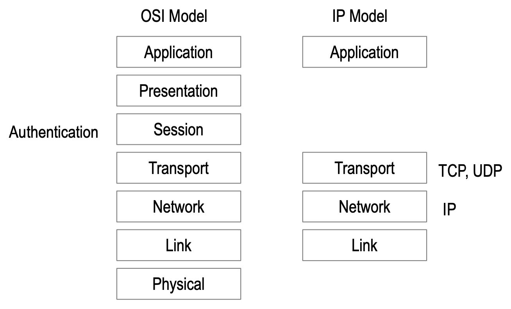
(_SamMSmith_)

## How can the internet be fixed?
Establish authenticity between the key pair and the identifier of IP packet’s message payload. [See more](https://ssimeetup.org/key-event-receipt-infrastructure-keri-secure-identifier-overlay-internet-sam-smith-webinar-58/) in presentation.

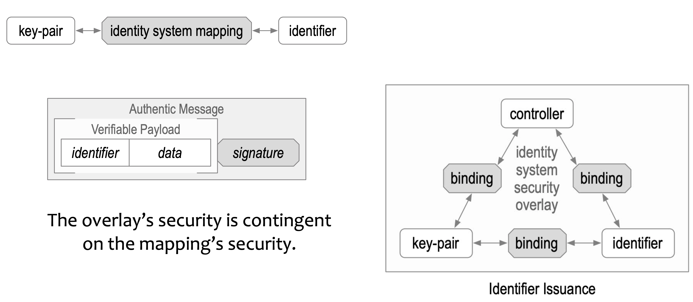
(_SamMSmith_)

## What's wrong with SSL certificate intermediairies?
Administrative Identifier Issuance and Binding; especially the binding between keypair and identifier based on an assertion of an intermediairy administrator. This is what's weak and therefore wrong. [See more](https://ssimeetup.org/key-event-receipt-infrastructure-keri-secure-identifier-overlay-internet-sam-smith-webinar-58/) in presentation.\
_(@henkvancann)_

## What's DNS Hijacking
A DNS hijacking wave is targeting companies at an almost unprecedented scale. Clever trick allows attackers to obtain valid TLS certificate for hijacked domains. [more](https://arstechnica.com/information-technology/2019/01/a-dns-hijacking-wave-is-targeting-companies-at-an-almost-unprecedented-scale/).\
_(@henkvancann)_

## What is 'platform locked trust' and why should we bother?
The `IPv4 layer` was become a standard internet transport layers over the years. It is a very strong structure. The transport layer has no security build into it. So the trust layer has to be something higher in the stack. However in the Support Application layers that sit on top of that IPv4, no standardization has taken place yet. It is a highly segmented layer and trust is therefore *locked* in those segments or platforms; it's not interoperable accross the internet. E.g. platform `Facebook` provides an identity system that only works within their domain. That's the same with for example `Google` or any number of blockchain.\
We don't have a trustable interoperability. And that leads to the idea that the internet is broken. We want to fix that, we don't want a domain segmented internet trust map, a bifurcated internet, we want to have a single trust map. This is the motivation for `KERI`.\
(_SamMSmith_)

## How to repair the internet trust layer?
With a waist and a neck. 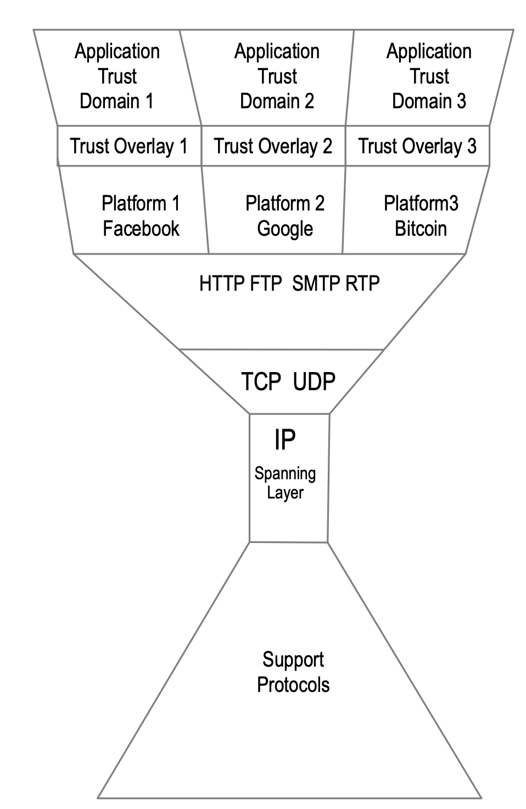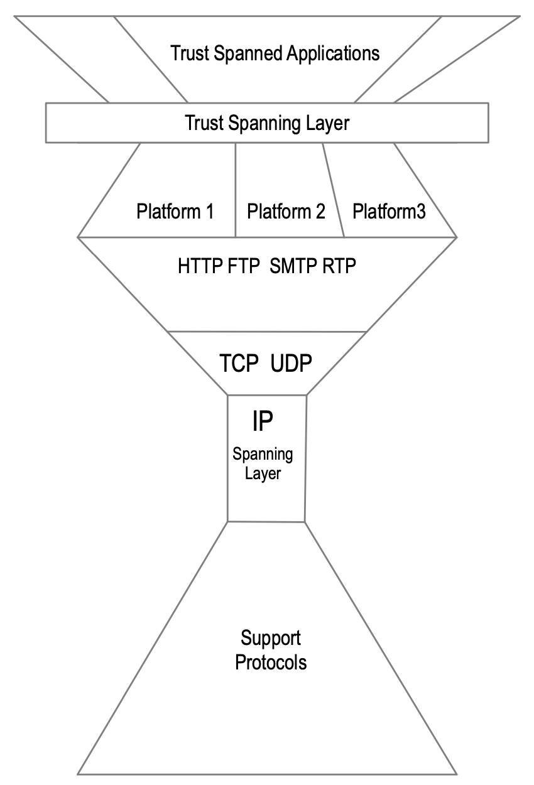
_(@henkvancann)_

## What role does KERI play in the suggested "repair of the internet"?
Much of the operation of internet infrastructure is inherently decentralized, but control over the value transported across this infrastructure may be much less so.\
Centralized value capture systems concentrate value and power and thereby provide both strong temptations for malicious administrators to wield that concentrated power to extract value from participants. \
We believe that _decentralization of value transfer_ is essential to building trust. Consequently a key compo- nent for a decentralized foundation of trust is an interoperable decentralized identity system. [Source: whitepaper page 7](https://github.com/SmithSamuelM/Papers/blob/master/whitepapers/KERI_WP_2.x.web.pdf)

## DHTs are not an immutable linear chronology oracle, which is the heart of the actual security problem. You claim KERI solves the security problem with DHTs?!
The immutable linear chronology is provided by the key event log (`KEL`) data structure itself. Getting a full copy is all you need. When retrieving a KEL over a network, then as you say a witness can prune some amount of the latest events, but every witness would have to be compromised for that to be undetectable.\
If parties are so concerned, they could establish a large collectivised set of witnesses that sign and distribute all key events presented to this network (this would essentially be a `Proof of Authority`/federated blockchain but would require (configurable)% compromise for undetectable pruning of recent history. Only PoA/federated because the witness sets are designated by the controllers, so you could not just use arbitrary witnesses who join and leave the network at leisure (afaik).

The difference between the chain and the DHT is that not all DHT nodes act as witnesses for all KELs in the system (in the sense that they dont provide receipts for every KEL and arent referenced in the witness sets of every KEL), but they could all (or at least the ones holding the KEL you seek) still provide availability for KELs and thus would have to all be compromised in order to hide a recent-history-pruning, only one has to transmit the new/complete version to prove all the other versions as being old/incomplete.\
_(CharlesCunningham)_

The point of KERI is to encapsulate all the guarantees within `KEL`s nothing else is needed. DHT is just for resolution process to find a place from where I can get it. This place can change as you like I could even get it in p2p interaction from someone else. DHT seems to be the most reasonable way to build solid infrastructure for resolution process but none of the nodes can actually inject or tamper KELs so you don't have to trust them or get any guarantees from them. Since if the node will miss behave it is very easy to detect that.\
_(RobertMitwicki)_

# Q&A section Identifiers

## How is a KERI identifier different than a regular identifier in DID methods?
A self-sovereign identifier that is not self-certifying is dependent of infrastructure and is not fully autonomous and not fully porteable. KERI uses autonomic identifiers, fully cryptographically derivable and portable.
_(@henkvancann)_

## Is my KERI identifier public?
In the direct mode (peer to peer) KERI can be used to keep identifiers private to the peers or group involved. In the indirect mode all identifiers are public. The privacy of the individual, group or object described by the identifier is weak because anyone can bind and indentifier to a subject anytime and anywhere. Fortunately, this binding is weak too, As soon as controllers and verfiers sign statements / events related to an identifier, that's when the binding gets strong and subjects publicly exposed.\
_(@henkvancann)_

## Is a KERI identifier GPDR proof?
KERI enables support for GDPR’s right to be forgotten.\
{TBW prio 1}\
_(@henkvancann)_

## What do I need a self-certifying identifier for?
It is a cryptographically derived, strong binding between a controller, a keypair and an identifier. No weak bindings introduced by administration present.
_(@henkvancann)_

## What do I need a self-addressing identifier for?
{TBW}

## What do I need a multi-sig self-addressing identifier for?
To get even more security in terms of your signing scheme.\
(_SamMSmith_)

## What do I need a delegated self-adressing identifier for?
To be able to horizontally scale your identifier system, that consists of a root identifier that manages a bunch of other delegated identifier. Created with a cryptographically derived strong binding, all the way through your infrastructure. Not dependent on any administration at all. \
(_SamMSmith_)

## What do I need a self-signing identifier for?
Often it is an efficiecy measure where the identifier includes the signature as your `content-addressable hash`.\
_(SamMSmith)_

## What do I need a non-transferable identifier for, as KERI supports transferable identifiers?
Its use is different. Many applications of self-certifying identifiers only require temporary use after which the identifier is abandoned. These are called ephemeral identifiers. Other applications may only attach a limited amount of value to the identifier such that replacing the identifier is not onerous.\
Because a non-transferable (ephemeral) identifier is not recoverable in the event of compromise, the only recourse is to replace the identifier with another identifier. In some applications this may be preferable, given the comparable simplicity of maintaining key state.\
In either of these cases a non-transferable self-certifying identifier is sufficient.

# Q&A section Event logs

## What is a Key Event Log?
It's the basis of the source of truth for KERI identifiers. KERI enables cryptographic proof-of-control-authority (provenance) for each identifier. A proof is in the form of an identifier’s key event receipt log (KERL), after a validator verified the registered events, in the chain of events: the key event log (KEL).\
_(@henkvancann)_

## Why is a Key Event Log crucially important?
Without KELs, we wouldn't have a chain of registered and signed key events for an identifier. The availability and consistency of the KEL is crucial for next steps: verification of events and duplicity checks. Without verified KELs there will be no KERL for identifiers at hand.\
_(@henkvancann)_

## How do I create a KEL?
By a key inception event. A controller creates a key pair and binds this to his/her KERI identifier.
There will be wallet software and an API available in the course of code development and also a DID scheme (DID:UN) that invokes calls to those APIs during resolution of the DID.
_(@henkvancann)_

## How can I trust a KEL?
It is secured by a `Distributed Hash Table`, so internal inconsistencies are cryptographically provable. If they they are internal consistent the first level of trust is established. Furthermore a KERL is end-verifiable to the root-of-trust. You don't need the whole KERL at all times [Read more why](https://github.com/henkvancann/keri/blob/master/docs/Q-and-A.md#do-i-need-to-show-the-full-log-kel-to-anybody-i-transact-with-even-though-id-only-like-to-show-a-part-of-it-for-example-a-virtual-credential). Together with the external consistency (duplicity check)
_(@henkvancann)_

# Q&A section Inconsistency and duplicity

## What kind of Inconsistencies do we have?
An internally inconsistent KEL, this simply won't verify. 
External inconsistency: two versions of the key event log (KEL).

## How can it be garantueed than an identifier represents a certain identity and not another one?
KERI takes advantage of its cryptographic root of trust with strong bindings, to get an inviable guarantee, based on both internal consistency for the cryptographic root of trust and external consistency using ambient duplicity detection.

## What is Duplicity?
See the [definition](#duplicity). What it means is that we have a way to make judgements about trust in entities.\
_(@henkvancann)_

## What does duplicity look like?
Duplicity takes two forms. In the first form, a `controller` may be deemed duplicitous whenever it produces an event message that is inconsistent with another event message it previously produced. In the second form, a witness may be deemed duplicitous when it produces an event _receipt_ that is in- consistent with another event receipt it previously produced.\
_(SamMSmith)_

## Why should we care about Duplicity?
Duplicity becomes a basis for distrust in a controller or its witnesses. _(SamMSmith)_

# Q&A section Key rotation

## What is Key Rotation?
Changing the key, i.e., replacing it by a new key. The places that use the key or keys derived from it (e.g., authorized keys derived from an identity key, legitimate copies of the identity key, or certificates granted for a key) typically need to be correspondingly updated.

the main purpose of key rotation it to either prevent or recover from a successful compromise of one or more private keys by an exploiter.\
[Source](https://csrc.nist.gov/glossary/term/Key_Rotation).

## Why bother about key rotation?
The primary purpose of rotating encryption keys is not to decrease the probability of a key being broken, but to reduce the amount of content encrypted with that key so that the amount of material leaked by a single key compromise is less.

However, for _signing keys_ there is a concrete reason: say it takes X months of computation (expected value given your threat model) to crack a key, and you rotate your signing key every 𝑋−1 months and revoke the old one, then by the time an attacker has cracked the key, any new signatures produced by the attacker will either be A) rejected by clients because of key expiry, or B) back-dated to before the key revocation (which should also raise warning in clients).\
[Source](https://crypto.stackexchange.com/questions/41796/whats-the-purpose-of-key-rotation).

## Why does KERI solve interoperability with its key rotation scheme? 
KERI uses plain old digital signatures from PKI, intentionally, so that it may be truly universally applied. KERI solves that hard problem of PKI, that is, key rotation in a standard way. Without a standard way of addressing key rotation, there is no interoperability between systems, they break when you rotate keys because no one knows how to verify the key rotation was done properly. KERI solves that problem.


## Wat is Pre-rotation?
Pre-rotation is a _cryptographical commitment (a hash)_ to the _next_ private key in the rotation-scheme. (_@henkvancann_)\
The pre-rotation scheme provides secure verifiable rotation that mitigates successful exploit of a given set of signing private keys from a set of (public, private) key-pairs when that exploit happens sometime **after** its creation _and_ its first use to issue a `self-certifying identifier`. In other words, it assumes that the private keys remains private **until after** issuance of the associated identifier.\
[Source: chapter Pre-rotation in whitepaper](https://github.com/SmithSamuelM/Papers/blob/master/whitepapers/KERI_WP_2.x.web.pdf)

## Why hasn't pre-rotation or forward chaining been done before?
I first wrote about in 2018, it's been public knowledge ever since. I guess people just don't read.\
(_SamMSmith_)

# Q&A section KEL and KERL

## What is the difference between KEL and KERL?
The word 'Receipt' explains it all: the sender signs off the verification of the KEL done by the recipient. That _Receipt_ is hosted in the KERL and is the root-of-trust for KERI.\

The analogy is the difference between a _two-way_ - and a _three-way handshake_: Did I, the recepient, only verify that the sender's message was valid (two-way using KEL, arrow left to right) or did the sender _sign off the receipt_ of that verification by the recipient (three-way in KERL, arrow right to left)
_(@henkvancann)_

# Q&A section Wallets

## Why do I need a wallet for KERI?
Yes. [Universal wallet](https://w3c-ccg.github.io/universal-wallet-interop-spec/) - would do - with a thin layer on top of it. \
A wallet needs to be adapted to KERI to be able to carry KERI identifiers.\
{TBW}\
(_SamMSmith_) / _(CharlesCunningham)_


## How can I backup the KERI identifiers in my wallet?
{TBW}
## Can I receive crypto money in my KERI wallet?
We don't need a crypto currency embedded in the KERI system, we can use any other crypto currency system for payment. So the design of the KERI system has left crypto token control out.\
_(@henkvancann)_

## Does a KERI wallet store virtual credentials connect to my identifiers?
The KERI whitepaper has little about virtual credentials and KERI's place in the W3C SSI space for DIDs and VCs. The reason is that KERI is mainly a level 1 and level 2 solution in the trust-over-ip framework.\
_(@henkvancann)_

In this presenation of Sam, there's a lot about the relation between KERI and VCs: https://github.com/SmithSamuelM/Papers/blob/master/presentations/GLEIF_with_KERI.web.pdf

# Q&A section Signatures

## Who can sign off my proofs and identifiers using KERI?
Depends on what you mean with proof. KERI is content agnostic, so any cryptographic proof can be referenced and signed in a KEL, even a third party signature. As far as KERI-internal proofs are concerned a subject-controller, a delegated controller and combination of (fractioned) multi-signatures can prove authoritative conrol over a key and over a pre-rotated key.
_(@henkvancann)_
{TBW prio 1}

## What is the practical use of signatures?
In general they can proof the control of a private key at a certain point back in time.
_(@henkvancann)_

## Do verifiers, validators, witnesses and watchers all sign off `payloads`?
Yes they do. For every cause there is a different payload. The main reason why all roles sign off cryptographical references is commitment to those sources (the payload in KERI is often a digest of sources) at a certain point in time.\
_(@henkvancann)_

# Q&A section Proofs

## What does KERI proof?
KERI has the ability to proof various thing:
 - Control over an Autonomous identifier (`AID`).
 - Control over a pre-rotated key
 - Commitment to an Event Log
 - Content addressing by a hash
 - Delegation of control over a key
 - {TBW prio 2}

## Does KERI know whether any message in the Event Logs are valid or true?
No, KERI is data-agnostic. KERI does make no statement about the validity of the payload data.
_(@henkvancann)_
## How can we verify that a statement by a controller is valid?
We may verify that the controller of a private key, (the who), made a statement but not the `validity` of the statement itself.\
(_SamMSmith_)
## How can we trust what was said or written?
We may build trust over time in what was said via histories of verifiably attributable (to whom) consistent statements, i.e. `reputation`.\
(_SamMSmith_)

## Do I need to show the full log (KEL) to anybody I transact with, even though I'd only like to show a part of it, for example a virtual credential?
Yes, because they can't verify the root of trust. They have to have access to the full log at some point in time. Once they verfied to the root of trust, once, they don't have to keep a copy of the full log. They have to keep the event they've seen and any event since, that they need to verify as they go.
(_SamMSmith_)

# Q&A section Private Key Management

## How secure is the KERI infrastructure?
KERI changes the discussion about security. From a discussion about the security of _infrastructure_ to a discussion about the security of your _key management infrastructure_. Most people when they think security, the think "oh, blockchain!": permissioned or permissionless, how hard is it to get 51% attack, etc.Non of that matters for KERI. KERI is all about "are your private keys private?!" And if _yes_, that drastically slims down the security discussion to brute force attacks to public keys. And because the next public keys are in fact protected by a hash, you have to brute force the hash algorithm, that is post-quantum secure.
So that is a very high level of infrastructural security.

So private key management and protection is the root of your security in KERI.

## How multi-tasking is the key infrastructure?
KERI has univalent, bivalent and multivalent infrastructures.\
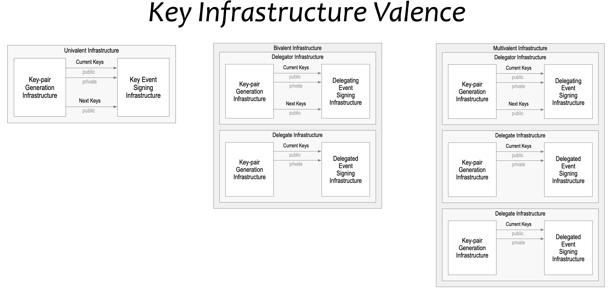
You need Key-pair Generation and Key Event Signing Infrastructure. And KERI doesn't care how you do it.
From bivalent delegation comes into play. But in fact you can have multivalent infrastructures, all with their own security garantuees and its own key management policies.\
It's all one KERI codebase to do all these infrastructures.\
(_SamMSmith_)

## Does your public-private-key format matter in KERI?
No, because the derivation code allows you to use whichever format you want. So anyone that sees an identifier looks at the first byte or two bytes prepended, it's a derived code, and you can tell exactly what type of public-private-key format we have, e.g. ecdsa.

When you rotate keys, you can always rotate to a different format.

## Can I use BIP32 Hierarchical deterministic keys in KERI to rotate?
Yes, you can derive your keys from that scheme. But KERI is agnostic about it, it wouldn't know.

## Not your keys, not your identity?
In KERI we say _identifier_, because **identity** is a loaded term, lots of misunderstanding around it.\
Pre rotated keys are best practise to keep control of your identifiers. \
If you lose unique control of a key right after inception, before rotation, are there no garantuees to be given for KERLs via witnesses / watchers or whatever. Is the only thing you can do about it, is revoke the key in that case?}\
_(@henkvancann)_

## A wallet is there to store my KERI private keys safely, no?
Currently _Universal wallet_ is aimed at to store KERI keys. The vast majority of security breaches or exposures of keys are originated by the behaviour of people: the way they use wallets. Most rarely due to errors in the wallet software.
{TBW prio 1}

## Are compound private keys (Shamir Secret Sharing) and multisignature schemes possible to incept identifiers?
Yes, complex fractional structures are natively possible in KERI. However only for the non-basic forms (for transferable identifiers).\
_(@henkvancann)_
{TBW prio 1}

## How to delegate control over my private keys that control my identifiers?
{TBW prio 3}


# Q&A section Blockchain

## Does KERI use a blockchain?
No, but KERI uses the same cryptographical building blocks as blockchains do. \
_(@henkvancann)_ \
However, KERI may be augmented with distributed consensus ledgers but does not require them. [Source: section conclusion in whitepaper](https://github.com/SmithSamuelM/Papers/blob/master/whitepapers/KERI_WP_2.x.web.pdf)


## What's the difference between KERI and blockchain?
`KERI` is a unordered hash-linked list of signed Key Event logs and blockchain is a timestamped ordered list of hash-linked blocks of signed transactions. What this means:
1. we don't need ordering in `KERI` and that frees us from consensus protocols in blockchains
2. Hash-linking is done on a lower level in `KERI` and preserves consistency and fuels revealance of duplicity.
3. In `KERI` proofs are cryptographically derived from the root of trust, being the autonomous controller, in blockchains the root-of-trust is a transaction on a ledger; that means the Identifier gets locked on the ledger.\
_(@henkvancann)_

## Why not register identities on an open public ledger like bitcoin, ethereum or soverin?
Because for our purposes we don't need to. Consider two distinct identifier to totally ordered, distributed consensus ledger:
1. the access identifier that allows you to access the ledger. This one is ussually a `SCI`. E.g. on bitcoin your bitcoin address is cryptographically derived from the public key from your keypair.
2. the register identifier that allows you to register an identifier on the ledger. The ledger transaction is validated registering of your identifier, not the cryptographic root-of-trust that the access identifier is using.

The identifier is now locked to that ledger. We want identifiers to be portable accross ledgers, so we don't want to use registration as the root-of-trust, we want to be self-certified all the way.
(_SamMSmith_)

## KERI is basically a series of Pay2PublicKeyHash transactions?
_that you send to witnesses, who observe them and attest to the particular line of operations they see?_

In brief: for KERI that is an apples and oranges comparison.

Because total linear ordering is not needed for a given identifier's event sequencing. Only linear order of that identifier's history. The history's from other events do not have to be ordered with respect to each other. So the secure ordering of a given identifier's history is a completely different class of problem than the secure total ordering of comingled history from multiple identifiers. The security demands are less for the former case. So the equivalent security may be obtained in other ways. While the latter as a side effect of total ordering gives local ordering (per identifier) for free. But securing total ordering may be much harder to do. So one has to be careful, because it's no longer an apples to apples comparison. 
(_SamMSmith_)

# Q&A section Agencies

## What does the governance framework of KERI look like?
> Decentralized systems must coordinate across multiple parties, all acting independently in their own self-interest. This means that the rules of engagement and interaction must be spelled out and agreed to ahead of time, with incentives, disincentives, consequences, processes, and procedures made clear.
{TBW prio 3}
DRAFT BY _(@henkvancann)_

KERI is self-administered, self-governed. What aspects of KERI need governance?

Purist permissionless network proponents will argue that a real decentralized network does not need a governance framework since mathematics and cryptography make sure that proper governance is in place.

The Trust over IP stack includes both a governance stack and technology stack.\
KERI governance roles at *Layer 1* can include: 
- Controller, Entropy hardware and software, KEL, KERL
*Layer 2: Provider governance frameworks*
- Governance of capabilities of digital wallets, agents, and agencies. So the need is primarily to establish baseline security, privacy, and data protection requirements, plus interoperability testing and certification programs, for the following roles:
- Hardware Developers: hardware security modules (HSMs)
- Software Developers: duplicity verification and internal consistency checks
- Agency: ambient availability of KELs and KERLs
*Layer 3: Credential governance frameworks*\
KERI is not an outspoken credential issuance and verification framework. Having said that:
- Controller: inception proof, revocation, delegation proof
- Holders: availability
- Verfifier: external inconsistency proofs
Layer 4: Ecosystem governance framework
- KERIs objective  is to be the spanning trust infrastructure of the whole internet
- Portability of the identities and KERI interoperability between platforms is cryptographically secured
- Inconsistencies "reported" by meercats-like alert governance system
 }

## How can KERI offer consistent services and truth?
A. In a pair-wise setting  each party only needs to be consistent with the other party. Witnesses are not used. It doesn't matter if they lie to each other as long as they lie consistently. KERI does not
enable someone to proof the *veracity* of a statement only the *authenticity* of the statement.\
(_SamMSmith_)

B. If 3 parties are involved in a transaction all they need do is query each other for the copy of the `KEL` that each is using for each other to ensure that there is no duplicity.\
(_SamMSmith_)

C. To **guarantee *undetectable* duplicity** requires a successful eclipse attack* on all the parties. `KERI` merely requires that there be sufficient duplicity detection in the ecosystem. \
This would be a set of `watchers` that the validators trust that record any and all copies of key event logs (`KEL`) that they see.  Because these `watchers` can be anyone and anywhere, any controller of a public identifier is at peril should they choose to publish inconsistent copies of their `KEL`. This removes the incentive to be duplicitous.\
'* Any blockchain system is also vulnerable to such an eclipse attack.\
(_SamMSmith_)

# Q&A section Witness
## Witnesses have no skin in the game, it’s a `nothing at stake` situation, no?
The [KERI slide deck](https://github.com/SmithSamuelM/Papers/blob/master/presentations/KERI2_Overview.web.pdf) has a section called the Duplicity Game.  I suggest reading through that first. Or see the [part of the SSI Meetup](https://ssimeetup.org/key-event-receipt-infrastructure-keri-secure-identifier-overlay-internet-sam-smith-webinar-58/) webinar that tackles this.\
(_SamMSmith_)
{TBW prio 2}

## What is the difference between Key Event Receipt Infrastructure (KERI), and distributed hash tables (DHTs)?
{TBW prio 3}

## As long as witnesses keep lying together no one will ever be able to prove them wrong? 
Witnesses do not make any statement about the content of what is being proved. KERI does not
enable someone to proof the *veracity* of a statement only the *authenticity* of the statement. {TBW} \
(_SamMSmith_)

# Q&A section Watchers

## How can we detect duplicity? Suppose controller has power over witnesses.
In a Public setting `duplicity detection` protects the validator from any duplicity on the part of the controller and any resources such as witness that are controlled by the controller.

Since a given controller in a public setting may not know who all a given validator is using for duplicity detection (watchers etc), the controller can't ensure that they will not be detected. And once detected any value that their public identifier had is now imperiled because *any entity with both copies can proof irrefutably to any other entity that the controller is duplicitous (i.e. not trustable)*. \
(_SamMSmith_)

# Q&A Virtual Credentials

## Why doesn't KERI use certification as a root of trust?
Why do we want portable identifiers instead of the Ledger Locked IDs, since we have DIDs that can resolve a ledger locked Id uniformly? You say “We don’t want to use certification as a root of trust, we want to do it self-certified all the way” -> what about the issuance of a credential based on the ledger locking, isn’t that beneficial?

## Is Custodianship of KERI identifiers possible? 
_Or does (Delegated, Multi-sig) Self-Adressing do the job?_\