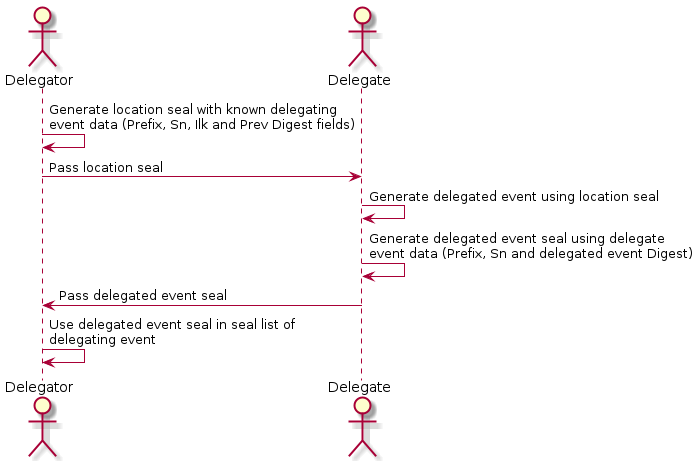

# KID0007 - Delegation

## Navigation

[Back to table of contents](readme.md)
|Link|Commentary|Section
|---|---|---|
|[0000](kid0000.md)|[X](kid0000Comment.md)|Glossary, overview, how to use|
|[0001](kid0001.md)|[X](kid0001Comment.md)|Prefixes, Derivation and derivation reference tables|
|[0002](kid0002.md)|[X](kid0002Comment.md)|Data model (field & event concepts and semantics)|
|[0003](kid0003.md)|[X](kid0003Comment.md)|Serialization|
|[0004](kid0004.md)|[X](kid0004Comment.md)|Key Configuration (Signing threshold & key set)|
|[0005](kid0005.md)|[X](kid0005Comment.md)|Next Key Commitment (Pre-Rotation)|
|[0006](kid0006.md)|[X](kid0006Comment.md)|Seals|
|0007|[X](kid0007Comment.md)|Delegation (pending PR by Sam)|
|[0008](kid0008.md)|[X](kid0008Comment.md)|Key-Event State Machine|
|[0009](kid0009.md)|[X](kid0009Comment.md)|Indirect Mode & Witnesses|
|0010||Recovery/consensus Algorithm (KAACE)|
|0011||Database & Storage Considerations|
|0097|n/a|**Non-Normative** Implementation Guidance|
|0098|n/a|Use Cases|
|0099|n/a|Test Vectors and Normative Statement Index

### Definition

A delegation or identifier delegation operation is provided by a pair of events. One event is the delegating event and the other event is the delegated event.

### Cooperative Delegation

This pairing of events is a somewhat novel approach to delegation in that the resultant delegation requires cooperation between the delegator and delegate. We call this cooperative delegation. In a cooperative delegation, a delegating identifier performs an establishment operation (inception or rotation) on a delegated identifier. 

A delegating event is a type of event that includes in its data payload an event seal of the delegated event that is the target the delegation operation. This delegated event seal includes a digest of the delegated event. 

Likewise the targeted delegated event has a delegating event location seal that includes the unique location of the delegating event:

The pair of seals cross-reference the two events participating in the cooperative delegation operation. In general we may refer to both delegating and delegated event seals as delegation event seals or delegation seals. A delegation seal is either an event seal or an event location seal. The delegating event seal is an event location seal and a delegated event seal is an event seal. The delegated event seal in the delegating event provides an anchor to the delegated event. Likewise, the delegating event location seal in the delegated event provides an anchor back to the delegating event. 

NOTE: Because the delegating event payload is a list, a single delegating event may perform **multiple** delegation operations, one per set of delegation seals.

A delegation operation may either delegate an inception or delegate a rotation that respectively may create and rotate the authoritative keys for a delegated self-certifying identifier prefix.

#### Applications
A common application for cooperative delegation would be to delegate signing authority to a new identifier prefix. The signing authority may be exercised by a sequence of revokable signing keys distinct from the keys used for the root identifier. This enables horizontal scalability of signing operations. 

The other major benefit of a cooperative delegation is that any exploiter that compromises only the delegate’s authoritative keys may not thereby capture control authority of the delegate. A successful exploiter must also compromise the delegator’s authoritative keys. Any exploit of the delegate is recoverable by the delegator.

### Delegating Interaction Event

A delegating interaction event includes in its data payload a seal of a delegation operation i.e. a delegating event seal that includes a digest of the delegated event. Likewise the delegated event has a delegated event seal that includes a digest of the delegating event location. The relationship between the pair of events and their corresponding seals can be understood by analogy to those in the previous section. The delegating interaction event data is shown below:

### Delegating Rotation Event

A delegating rotation event or delegating event is a type of extended rotation event that includes in its data payload a delegation seal. By virtue of mixing {including?} the delegation seal in a rotation operation, the effective delegation signing keys may be better protected from exposure by their one-time first-time use in the rotation operation. Otherwise a delegating rotation event is identical to a delegating inception event as described above.

### Delegated Key Event Sequence

### Delegation Flow Diagram

For underlying UML, see [here](../images/delegation_flow.plantuml)
